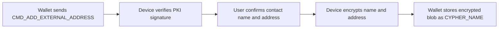
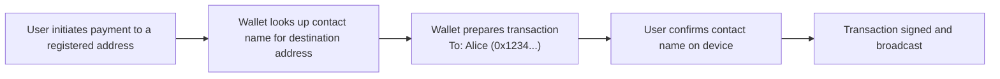
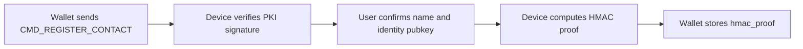
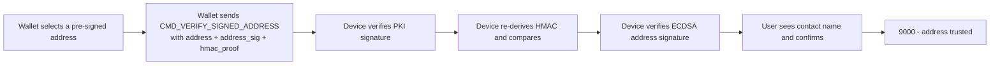
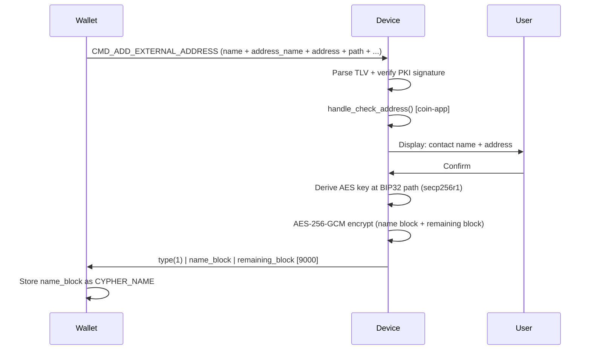
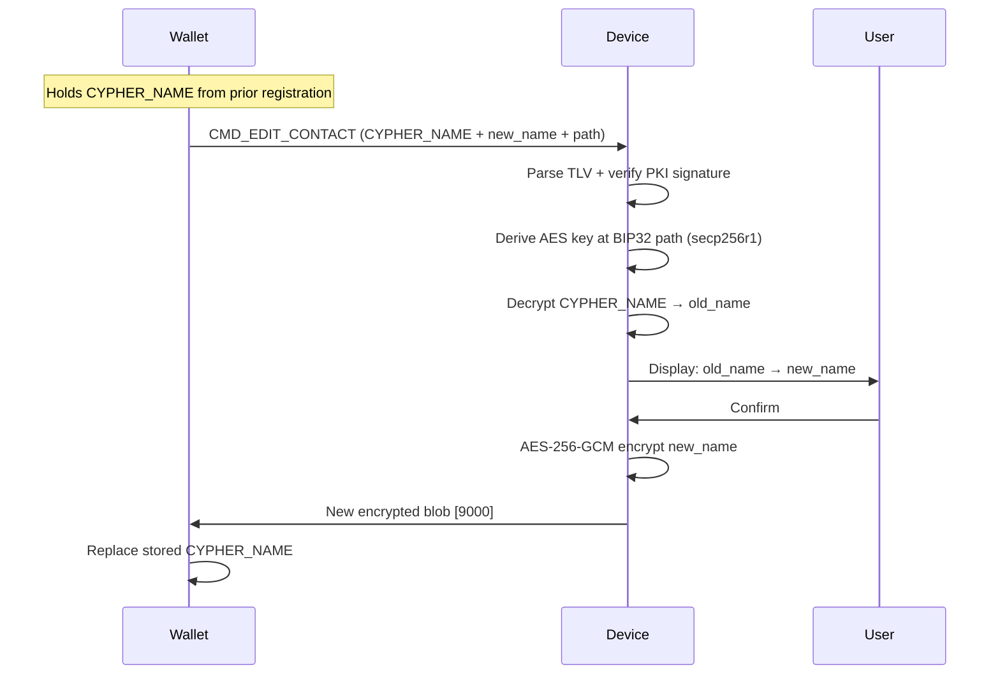
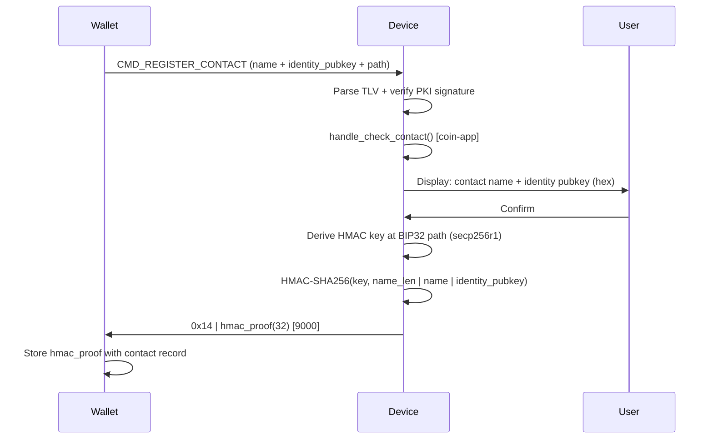
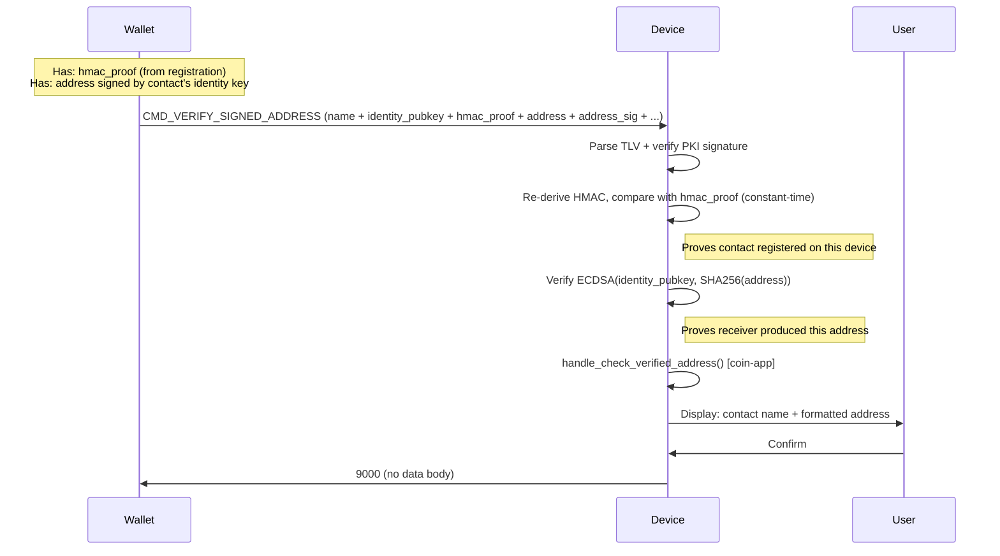
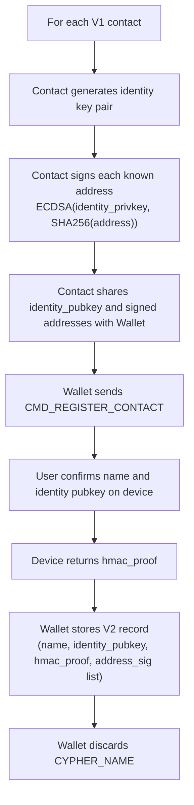

# Address Book — Implementation Specification

> **Version:** 2.0 — covering V1 (address-centric) and V2 (identity-key-centric, "Contacts" proposal)
> **Date:** 2026-03-28

---

## Table of Contents

1. [Overview](#1-overview)
2. [Compilation flags](#2-compilation-flags)
3. [APDU interface](#3-apdu-interface)
4. [Common foundations](#4-common-foundations)
   - 4.1 [TLV encoding](#41-tlv-encoding)
   - 4.2 [TLV tag registry](#42-tlv-tag-registry)
   - 4.3 [Ledger PKI signature](#43-ledger-pki-signature)
   - 4.4 [Cryptographic KDFs](#44-cryptographic-kdfs)
5. [V1 — Address Book (address-centric)](#5-v1--address-book-address-centric)
   - 5.1 [Register External Address](#51-register-external-address)
   - 5.2 [Edit Contact](#52-edit-contact)
   - 5.3 [Register Ledger Account](#53-register-ledger-account)
   - 5.4 [V1 response format (AES-256-GCM encrypted blob)](#54-v1-response-format-aes-256-gcm-encrypted-blob)
   - 5.5 [V1 coin-app entrypoints](#55-v1-coin-app-entrypoints)
6. [V2 — Contacts (identity-key-centric)](#6-v2--contacts-identity-key-centric)
   - 6.1 [Register Contact](#61-register-contact)
   - 6.2 [Verify Signed Address](#62-verify-signed-address)
   - 6.3 [V2 response format (HMAC Proof of Registration)](#63-v2-response-format-hmac-proof-of-registration)
   - 6.4 [V2 coin-app entrypoints](#64-v2-coin-app-entrypoints)
7. [V1 vs V2 — Comparison](#7-v1-vs-v2--comparison)
8. [Status words](#8-status-words)

---

## 1. Overview

The **Address Book** feature allows a Ledger device to securely associate human-readable names with blockchain addresses, so users see a familiar name rather than a raw address during a transaction review.

Two generations of the protocol exist:

| Generation | Name         | Concept                                             | Activation flag                                    |
|------------|--------------|-----------------------------------------------------|----------------------------------------------------|
| **V1**     | Address Book | Binds a name to a blockchain **address**            | `HAVE_ADDRESS_BOOK`                                |
| **V2**     | Contacts     | Binds a name to a contact's **identity public key** | `HAVE_ADDRESS_BOOK` + `HAVE_ADDRESS_BOOK_CONTACTS` |

**V1** is address-centric: the host registers `(name, address)` pairs directly. It was designed for a single blockchain family and stores the binding as a server-side AES-GCM encrypted blob.

**V2** (the "Contacts" proposal) is identity-key-centric: the host registers `(name, identity_pubkey)` pairs. The binding is blockchain-agnostic. At payment time the receiver signs their address with their identity private key and the device verifies both the binding (via HMAC) and the address origin (via ECDSA). The V2 response is a deterministic HMAC-based Proof of Registration stored server-side.

Both versions share the same APDU command (`CLA=0xB0 INS=0x10`), the same TLV encoding, and the same Ledger PKI signature scheme. V2 is strictly additive: V1 sub-commands continue to work unchanged.

### V1 use case

**Step 1 — Registration (once per address):**



**Step 2 — Payment:**

The wallet has stored the `(name, address)` mapping from the registration response. When the user sends funds to a registered address, the wallet substitutes the raw address with the contact name in the transaction review.



### V2 end-to-end use case

**Step 1 — Registration (once per contact):**



**Step 2 — Payment (each time the sender pays the contact):**

The wallet has stored the `(name, identity_pubkey, hmac_proof, [address, address_sig])` mapping from the registration and contact setup. At payment time it selects one address and sends it to the device along with its signature and the HMAC proof.



---

## 2. Compilation flags

```makefile
# V1 — required for all address book features
DEFINES += HAVE_ADDRESS_BOOK

# V2 — requires HAVE_ADDRESS_BOOK; enables Contacts sub-commands
DEFINES += HAVE_ADDRESS_BOOK_CONTACTS
```

`HAVE_ADDRESS_BOOK_CONTACTS` cannot be defined without `HAVE_ADDRESS_BOOK` — a `#error` will be raised at compile time.

---

## 3. APDU interface

All Address Book commands share a single APDU:

```text
CLA  INS  P1          P2    Lc        Data
0xB0 0x10 <sub-cmd>   0x00  <length>  <TLV payload>
```

For payloads longer than 255 bytes, **extended APDU encoding** is used:

```text
CLA  INS  P1  P2   0x00  LC_HIGH  LC_LOW  Data[LC_HIGH<<8 | LC_LOW]
```

### Sub-command table

| P1   | Sub-command                | Version | Guard                        |
|------|----------------------------|---------|------------------------------|
| 0x00 | Add External Address       | V1      | `HAVE_ADDRESS_BOOK`          |
| 0x01 | Edit External Address      | V1      | `HAVE_ADDRESS_BOOK`          |
| 0x02 | Edit Contact               | V1      | `HAVE_ADDRESS_BOOK`          |
| 0x03 | Register Ledger Account    | V1      | `HAVE_ADDRESS_BOOK`          |
| 0x04 | Rename Ledger Account      | V1      | `HAVE_ADDRESS_BOOK`          |
| 0x05 | Register Contact           | **V2**  | `HAVE_ADDRESS_BOOK_CONTACTS` |
| 0x06 | Verify Signed Address      | **V2**  | `HAVE_ADDRESS_BOOK_CONTACTS` |

---

## 4. Common foundations

### 4.1 TLV encoding

All TLV fields use BER-TLV compact encoding:

```text
Tag   (1 byte)     — see §4.2
Length (1–2 bytes) — DER-style: value < 0x80 → 1 byte; otherwise 0x81..0x82 prefix
Value  (Length bytes)
```

Multi-byte integer values are encoded **big-endian, minimum length** (no leading zero bytes unless the value is zero itself).

### 4.2 TLV tag registry

The following tags are used across V1 and V2 structures. Tags are unambiguous within a given TLV structure type.

| Tag  | Name              | Type    | Description                                                                          |
|------|-------------------|---------|--------------------------------------------------------------------------------------|
| 0x01 | STRUCT_TYPE       | V1 + V2 | Structure type discriminator (see each section)                                      |
| 0x02 | STRUCT_VERSION    | V1 + V2 | Structure version (currently `0x01` for all)                                         |
| 0x0A | CONTACT_NAME      | V1 + V2 | Contact/account name (printable ASCII, max 32 chars)                                 |
| 0x0B | ADDRESS_NAME      | V1      | Label for a blockchain address                                                       |
| 0x0C | ACCOUNT_NAME      | V1      | Name for a Ledger account                                                            |
| 0x0D | CYPHER_NAME       | V1      | AES-GCM encrypted name blob from a previous response                                 |
| 0x15 | DER_SIGNATURE     | V1 + V2 | Ledger PKI DER-encoded ECDSA signature over SHA-256 of preceding TLV fields          |
| 0x21 | DERIVATION_PATH   | V1 + V2 | BIP32 path (packed: depth(1) + indices(4 each))                                      |
| 0x22 | ADDRESS           | V1 + V2 | Raw blockchain address bytes                                                         |
| 0x23 | CHAIN_ID          | V1 + V2 | Blockchain chain ID (Ethereum)                                                       |
| 0x25 | IDENTITY_PUBKEY   | **V2**  | Compressed secp256r1 identity public key (33 bytes, prefix 0x02/0x03)                |
| 0x26 | HMAC_PROOF        | **V2**  | 32-byte HMAC-SHA256 Proof of Registration                                            |
| 0x29 | ADDRESS_SIGNATURE | **V2**  | DER-encoded ECDSA signature of SHA-256(address) by identity key                      |
| 0x2A | MINT_ADDRESS      | **V2**  | Token mint address (Solana SPL tokens only, 32 bytes)                                |
| 0x50 | DERIVATION_SCHEME | V1      | Key derivation scheme, Bitcoin only (1=BIP-44, 2=BIP-84, 3=BIP-86, 4=Generic)        |
| 0x51 | BLOCKCHAIN_FAMILY | V1 + V2 | Blockchain family (0=Bitcoin, 1=Ethereum, 2=Solana, 3=Polkadot, 4=Cosmos, 5=Cardano) |

> **Tag allocation note:** Tags 0x24 (TICKER), 0x27 (TX_HASH), 0x28 (DOMAIN_HASH) are reserved for other SDK structures and **must not** be reused in Address Book payloads.

### 4.3 Ledger PKI signature

Every TLV payload must include a `DER_SIGNATURE` (tag `0x15`) field as the **last** field. The signature is:

- Algorithm: **ECDSA-SHA256** over **secp256r1**
- Key usage: `CERTIFICATE_PUBLIC_KEY_USAGE_ADDRESS_BOOK`
- Message: **SHA-256 of all TLV bytes preceding the DER_SIGNATURE field**
- Encoding: DER (up to 72 bytes)

The device computes the rolling SHA-256 hash of incoming TLV data via the `common_handler` callback, and calls `address_book_verify_signature()` at validation time.

### 4.4 Cryptographic KDFs

Both V1 and V2 derive a symmetric key from the secp256r1 private key at a given BIP32 path, using SHA-256 and a domain-separation salt.

#### V1 — AES-256 key

```text
aes_key = SHA256("AddressBook-AES-256-Key" || privkey.d)
```

Used to encrypt/decrypt the name blob returned to the host.

#### V2 — HMAC-SHA256 key

```text
hmac_key = SHA256("AddressBook-HMAC-Key" || privkey.d)
```

Used to compute the Proof of Registration. The two salts are distinct, preventing key reuse between V1 and V2 even when the same BIP32 path is used.

---

## 5. V1 — Address Book (address-centric)

### 5.1 Register External Address

**Sub-command:** P1 = `0x00`
**Structure type:** `0x11` (`TYPE_EXTERNAL_ADDRESS`)

Registers a `(contact_name, address_name, address_raw)` tuple under the user's device.

#### TLV payload

| Tag  | Mandatory | Max size | Description                                         |
|------|-----------|----------|-----------------------------------------------------|
| 0x01 | Yes       | 1 B      | STRUCT_TYPE = 0x11                                  |
| 0x02 | Yes       | 1 B      | STRUCT_VERSION = 0x01                               |
| 0x0A | Yes       | 32 B     | Contact name (max 32 printable ASCII chars)         |
| 0x0B | Yes       | 32 B     | Address name / label (max 32 printable ASCII chars) |
| 0x22 | Yes       | 64 B     | Raw address bytes (e.g. 20 bytes for Ethereum)      |
| 0x21 | Yes       | 41 B     | BIP32 derivation path                               |
| 0x23 | Yes       | 8 B      | Chain ID                                            |
| 0x51 | Yes       | 1 B      | Blockchain family (1 = Ethereum)                    |
| 0x15 | Yes       | 72 B     | DER Ledger PKI signature (last field)               |

> **Note on address size:** `MAX_ADDRESS_LENGTH = 64 B` covers all supported families — Ethereum (20 B), Bitcoin (≤ 34 B), Solana (32 B), Polkadot (32 B), Cosmos (20 B), Cardano (up to ~57 B).

#### Flow

1. Parse TLV payload.
2. Verify Ledger PKI signature.
3. Call `handle_check_address()` (coin-app entrypoint) for blockchain-specific validation.
4. Display to user: contact name + address name + address.
5. On confirm: compute and return [AES-GCM encrypted blob](#54-v1-response-format-aes-256-gcm-encrypted-blob).



#### Response (on confirm)

```text
0x11 | name_block | remaining_block
```

- `name_block` encrypts: `len(1) | contact_name`
- `remaining_block` encrypts: `len(1) | address_name | len(1) | address_raw | chain_id(8) | family(1)`

See §5.4 for the block-level encoding. The host stores `name_block` as `CYPHER_NAME`.

### 5.2 Edit Contact

**Sub-command:** P1 = `0x02`
**Structure type:** `0x13` (`TYPE_EDIT_CONTACT`)

Renames an existing contact. The `CYPHER_NAME` field is the encrypted name block returned by the original registration response, acting as a server-managed reference to the stored contact.

#### TLV payload

| Tag  | Mandatory | Max size | Description                                                 |
|------|-----------|----------|-------------------------------------------------------------|
| 0x01 | Yes       | 1 B      | STRUCT_TYPE = 0x13                                          |
| 0x02 | Yes       | 1 B      | STRUCT_VERSION = 0x01                                       |
| 0x0D | Yes       | 64 B     | Encrypted name block (CYPHER_NAME — from previous response) |
| 0x0A | Yes       | 32 B     | New contact name (max 32 printable ASCII chars)             |
| 0x21 | Yes       | 41 B     | BIP32 derivation path (same as at registration)             |
| 0x15 | Yes       | 72 B     | DER Ledger PKI signature                                    |

#### Flow

1. Parse TLV payload.
2. Verify Ledger PKI signature.
3. Decrypt `CYPHER_NAME` using the AES key at the given BIP32 path.
4. Display old name → new name to user.
5. On confirm: return new AES-GCM encrypted blob for the new name.



#### Response (on confirm)

```text
0x13 | name_block
```

- `name_block` encrypts: `len(1) | new_contact_name`

The host replaces the previously stored `CYPHER_NAME` with the new `name_block`.

### 5.3 Register Ledger Account

**Sub-command:** P1 = `0x03`
**Structure type:** `0x12` (`TYPE_LEDGER_ACCOUNT`)

Registers a name for a Ledger-owned account (derivation path + chain).

#### TLV payload

| Tag  | Mandatory | Max size | Description                                 |
|------|-----------|----------|---------------------------------------------|
| 0x01 | Yes       | 1 B      | STRUCT_TYPE = 0x12                          |
| 0x02 | Yes       | 1 B      | STRUCT_VERSION = 0x01                       |
| 0x0C | Yes       | 32 B     | Account name (max 32 printable ASCII chars) |
| 0x21 | Yes       | 41 B     | BIP32 derivation path                       |
| 0x50 | Yes       | 1 B      | Derivation scheme (see §4.2)                |
| 0x23 | Cond.     | 8 B      | Chain ID (mandatory for Ethereum)           |
| 0x51 | Yes       | 1 B      | Blockchain family                           |
| 0x15 | Yes       | 72 B     | DER Ledger PKI signature                    |

> **Note on DERIVATION_SCHEME:** this field is meaningful for Bitcoin only, where the same seed can produce different address formats (legacy, SegWit, Taproot). For all other families (Ethereum, Solana, etc.) it is always `BIP-44` and carries no additional information.

#### Flow

1. Parse TLV payload.
2. Verify Ledger PKI signature.
3. Call `handle_check_account()` (coin-app entrypoint).
4. Display account name + path to user.
5. On confirm: return AES-GCM encrypted blob.

#### Response (on confirm)

```text
0x12 | name_block | remaining_block
```

- `name_block` encrypts: `len(1) | account_name`
- `remaining_block` encrypts: `path_len(1) | path_items(4×N) | derivation_scheme(1) | chain_id(8) | family(1)`

See §5.4 for the block-level encoding.

### 5.4 V1 response format (AES-256-GCM encrypted blob)

On user confirmation the device sends:

```text
type(1) | name_block | remaining_block
```

where each block has the format:

```text
len_ciphertext(1) | ciphertext | len_iv(1=0x0C) | iv(12) | len_tag(1=0x10) | tag(16)
```

- `type` is the structure type byte (`0x11`, `0x12`, or `0x13`).
- **name_block** always encrypts: `len(1) | name`
- **remaining_block** plaintext is command-specific:

| Command                  | `remaining_block` plaintext                                                                |
|--------------------------|--------------------------------------------------------------------------------------------|
| Register External Addr.  | `len(1) \| address_name \| len(1) \| address_raw \| chain_id(8) \| family(1)`              |
| Edit Contact             | *(absent — no remaining block is appended to the response)*                                |
| Register Ledger Account  | `path_len(1) \| path_items(4*N) \| derivation_scheme(1) \| chain_id(8) \| family(1)`       |

The AES-256 key is derived at the given BIP32 path using the [AES KDF](#44-cryptographic-kdfs). The IV is randomly generated per-call. The response is **encrypted but not signed**. The host stores `name_block` and presents it as `CYPHER_NAME` in future Edit operations.

### 5.5 V1 coin-app entrypoints

| Entrypoint                                     | Called when                                 | Expected return                      |
|------------------------------------------------|---------------------------------------------|--------------------------------------|
| `handle_check_address(external_address_t *)`   | Before displaying Register External Address | `true` to proceed, `false` to reject |
| `get_external_address_tagValue(pair *, index)` | NBGL tag-value callback during review       | Fills the pair to display            |
| `finalize_ui_external_address(void)`           | After user choice                           | Cleanup + return to idle             |
| `handle_check_account(ledger_account_t *)`     | Before displaying Register Ledger Account   | `true` to proceed, `false` to reject |
| `get_ledger_account_tagValue(pair *, index)`   | NBGL tag-value callback                     | Fills the pair to display            |
| `finalize_ui_ledger_account(void)`             | After user choice                           | Cleanup + return to idle             |

---

## 6. V2 — Contacts (identity-key-centric)

V2 introduces a two-step protocol:

1. **Register Contact** (`0x05`): bind `(name, identity_pubkey)` on device → get HMAC Proof of Registration.
2. **Verify Signed Address** (`0x06`): at payment time, present the HMAC proof + a pre-signed address → device verifies the chain of trust and displays the contact name.

The receiver signs their payment address(es) **offline and in advance** using their identity private key, as part of sharing their contact details. The wallet stores these pre-signed addresses alongside the HMAC proof. At payment time, the wallet selects an address and sends it — together with its signature and the HMAC proof — to the device for verification. The device never interacts with the receiver directly.

The identity public key is a **compressed secp256r1** key (`0x02`/`0x03` prefix, 33 bytes). It is a long-lived key that identifies the contact across all blockchain networks. It **must not** be used directly as a payment key.

### 6.1 Register Contact

**Sub-command:** P1 = `0x05`
**Structure type:** `0x14` (`TYPE_REGISTER_CONTACT`)
**Guard:** `HAVE_ADDRESS_BOOK_CONTACTS`

#### TLV payload

| Tag  | Mandatory | Max size | Description                                          |
|------|-----------|----------|------------------------------------------------------|
| 0x01 | Yes       | 1 B      | STRUCT_TYPE = 0x14                                   |
| 0x02 | Yes       | 1 B      | STRUCT_VERSION = 0x01                                |
| 0x0A | Yes       | 32 B     | Contact name (max 32 printable ASCII chars)          |
| 0x25 | Yes       | 33 B     | Identity public key (compressed secp256r1, 33 bytes) |
| 0x21 | Yes       | 41 B     | BIP32 derivation path (used to derive HMAC key)      |
| 0x15 | Yes       | 72 B     | DER Ledger PKI signature                             |

#### Flow

1. Parse TLV payload.
2. Verify Ledger PKI signature.
3. Call `handle_check_contact()` (coin-app entrypoint).
4. Display to user: contact name + identity public key (hex).
5. On confirm: compute HMAC Proof of Registration and return it.



### 6.2 Verify Signed Address

**Sub-command:** P1 = `0x06`
**Structure type:** `0x16` (`TYPE_VERIFY_ADDRESS`)
**Guard:** `HAVE_ADDRESS_BOOK_CONTACTS`

#### TLV payload

| Tag  | Mandatory | Max size | Description                                                                      |
|------|-----------|----------|----------------------------------------------------------------------------------|
| 0x01 | Yes       | 1 B      | STRUCT_TYPE = 0x16                                                               |
| 0x02 | Yes       | 1 B      | STRUCT_VERSION = 0x01                                                            |
| 0x0A | Yes       | 32 B     | Contact name (must match value used at registration)                             |
| 0x25 | Yes       | 33 B     | Identity public key (same 33-byte key as at registration)                        |
| 0x26 | Yes       | 32 B     | HMAC Proof of Registration (32 bytes, from Register Contact response)            |
| 0x22 | Yes       | 64 B     | Raw address bytes (e.g. 20 bytes for Ethereum)                                   |
| 0x29 | Yes       | 72 B     | DER-encoded ECDSA signature of `SHA256(address_raw)` by identity key (secp256r1) |
| 0x2A | No        | 32 B     | SPL token mint address (Solana only, fixed 32 bytes)                             |
| 0x21 | Yes       | 41 B     | BIP32 derivation path (same as at registration)                                  |
| 0x51 | Yes       | 1 B      | Blockchain family (1 = Ethereum)                                                 |
| 0x23 | Cond.     | 8 B      | Chain ID (mandatory when `BLOCKCHAIN_FAMILY = 1`)                                |
| 0x15 | Yes       | 72 B     | DER Ledger PKI signature                                                         |

> **Note on APDU size:** a full Verify Signed Address payload is typically ~279 bytes and requires extended APDU encoding (see §3).

#### Flow

1. Parse TLV payload.
2. Verify Ledger PKI signature (proves payload is authentic).
3. Re-derive HMAC and compare with `HMAC_PROOF` (constant-time) — proves `(name, identity_pubkey)` was registered on *this* device.
4. Verify ECDSA: `verify(identity_pubkey, SHA256(address_raw), address_signature)` on secp256r1 — proves the intended receiver produced this address with their identity key.
5. Call `handle_check_verified_address()` (coin-app entrypoint) for coin-specific validation (address format, chain ID, etc.).
6. Display to user: contact name + (coin-formatted) address.
7. On confirm: return `SWO_SUCCESS` (9000). No encrypted payload.



### 6.3 V2 response format (HMAC Proof of Registration)

#### Register Contact response

```text
type(1) | hmac_proof(32)
```

- `type` = `0x14` (`TYPE_REGISTER_CONTACT`)
- `hmac_proof` = 32-byte HMAC-SHA256 output (see §6.1)

The host stores `hmac_proof` alongside the contact record and includes it verbatim in all future Verify Signed Address requests.

#### Verify Signed Address response

On success: `SWO_SUCCESS` (status word `0x9000`), no data body.

On rejection by user or failed validation: `SWO_INCORRECT_DATA` (`0x6A80`) or `SWO_SECURITY_CONDITION_NOT_SATISFIED` (`0x6982`).

### 6.4 V2 coin-app entrypoints

| Entrypoint                      | Signature              | Called when                           | Expected return                                        |
|---------------------------------|------------------------|---------------------------------------|--------------------------------------------------------|
| `handle_check_contact`          | `(contact_t *)`        | Before displaying Register Contact    | `true` to proceed, `false` to reject                   |
| `get_register_contact_tagValue` | `(pair *, index)`      | NBGL tag-value callback during review | Fills pair (pair 0 = name, pair 1 = pubkey hex)        |
| `finalize_ui_register_contact`  | `(void)`               | After user choice on Register Contact | Cleanup + return to idle                               |
| `handle_check_verified_address` | `(verify_address_t *)` | Before displaying Verify Address      | `true` to proceed, `false` to reject                   |
| `get_verify_address_tagValue`   | `(pair *, index)`      | NBGL tag-value callback during review | Fills pair (pair 0 = name, pair 1 = formatted address) |
| `finalize_ui_verify_address`    | `(void)`               | After user choice on Verify Address   | Cleanup + return to idle                               |

---

## 7. V1 vs V2 — Comparison

### 7.1 Feature comparison

| Aspect                             | V1                                                            | V2                                                                     |
|------------------------------------|---------------------------------------------------------------|------------------------------------------------------------------------|
| **Binding model**                  | name ↔ blockchain address                                     | name ↔ identity public key                                             |
| **Blockchain agnostic**            | No (address is blockchain-specific)                           | Yes (one identity key per contact, any chain)                          |
| **Registration granularity**       | Per address                                                   | Per contact (then one or many addresses per contact)                   |
| **Device stores**                  | Nothing (stateless)                                           | Nothing (stateless)                                                    |
| **Response to host**               | AES-256-GCM encrypted blob (`name_block` + `remaining_block`) | 32-byte HMAC Proof of Registration                                     |
| **Cryptographic primitive**        | AES-256-GCM (encrypt + decrypt)                               | HMAC-SHA256 (keyed hash)                                               |
| **KDF salt**                       | `"AddressBook-AES-256-Key"`                                   | `"AddressBook-HMAC-Key"`                                               |
| **Address verification**           | Implicit (user sees and approves address at registration)     | Explicit (ECDSA check by identity key at payment time)                 |
| **Edit workflow**                  | Possible: present `CYPHER_NAME` blob + new name               | No edit operation defined in V2                                        |
| **APDU payload size**              | < 255 bytes (standard)                                        | Can exceed 255 bytes → extended APDU required                          |
| **Trust root for contact binding** | Ledger backend (PKI signature)                                | Ledger backend (PKI) + device-local HMAC (proof of prior registration) |
| **Coin-app entrypoints**           | `handle_check_address`, `handle_check_account`                | `handle_check_contact`, `handle_check_verified_address`                |
| **Compilation guard**              | `HAVE_ADDRESS_BOOK`                                           | `HAVE_ADDRESS_BOOK` + `HAVE_ADDRESS_BOOK_CONTACTS`                     |
| **Sub-commands**                   | Add External Address, Edit Contact, Register Ledger Account   | Register Contact, Verify Signed Address                                |

#### Security model comparison

In V1, the device trusts that the host presents a valid `(name, address)` pair signed by the Ledger backend. The device has no way to verify at payment time that the address actually belongs to the intended recipient.

In V2, the chain of trust is stronger:

```text
Registration time:
  Ledger backend ──PKI sig──▶ device  ──HMAC──▶ hmac_proof (stored by host)

Payment time:
  1. device re-derives HMAC and compares → proves (name, identity_pubkey) registered here
  2. device verifies ECDSA(identity_key, SHA256(address)) → proves receiver produced address
  Result: user sees "Send to Alice" instead of a raw hex address
```

### 7.2 Which version to use?

#### For Ethereum

Ethereum addresses are stable — the same address is reused across all transactions for a given account. This makes the V1 `name ↔ address` binding directly workable.

**V1 is well-suited for Ethereum** and is significantly simpler to integrate: no identity key management, no address pre-signing, no extended APDU encoding. The Ledger backend PKI signature provides sufficient trust for typical use cases.

V2 provides an additional guarantee that V1 does not: even if the wallet is compromised and substitutes the destination address, the device detects it (the `hmac_proof` or `address_sig` would not match). For most Ethereum use cases this threat is outside the considered scope, making V2's added complexity difficult to justify.

#### For Bitcoin

Bitcoin follows a UTXO model where a fresh address should be used for each incoming transaction. Registering each address individually in V1 is impractical — there is no stable binding between a contact and a single address.

**V2 is necessary for Bitcoin**: the contact is identified by their identity key, and any address they generate and sign can be verified at payment time, regardless of how many different addresses they use.

#### For Solana

Solana accounts have **stable addresses** (32-byte Ed25519 public keys), reused across all SOL transactions for a given account — similar to Ethereum. V1 is therefore applicable for SOL transfers.

However, Solana introduces **SPL tokens**, which add a significant constraint: token transfers do not go to the recipient's main address but to their **Associated Token Account (ATA)**. An ATA is a **Program Derived Address (PDA)** — an address computed deterministically by the ATA program from a fixed set of inputs, with no associated private key:

```text
ATA = PDA(
    seeds   = [recipient_pubkey, token_program_id, mint_address],
    program = Associated Token Account program
)
```

This means a contact that receives multiple tokens has **one address per token** (one ATA per mint) in addition to their main SOL address. The implications are:

- **V1**: each ATA can be registered individually. This works, but a contact with several tokens requires as many registrations, and the current TLV structure has no field for the **mint address** — the device cannot display which token the address corresponds to during the review.
- **V2**: the wallet stores a list of `(address, address_sig)` pairs per contact, naturally accommodating multiple ATAs. The same limitation applies regarding the missing mint field in the current TLV.

**Recommendation for Solana:**

- For **SOL-only** transfers: **V1** is sufficient, same reasoning as Ethereum.
- For **SPL token** transfers: **V2** is better suited (multiple addresses per contact), but requires a new TLV tag for the mint address to allow the device to display meaningful token context during the review.

**Open point — identity key curve:** Solana natively uses Ed25519, while the current V2 implementation uses secp256r1 for the identity key. Since the identity key is a dedicated key (not the contact's payment key), secp256r1 remains valid. Supporting Ed25519 would allow contacts to sign addresses with their native Solana key, but requires extending `verify_address_signature()` to handle `CX_CURVE_Ed25519`.

#### For cross-chain contacts

V1 contacts are chain-specific: a contact must be registered separately for each chain and each address. V2 introduces a single identity key per contact that is blockchain-agnostic, covering all chains with one registration.

**V2 is recommended when contacts span multiple chains**, to avoid duplicating registrations and to keep a single source of truth per contact. The `BLOCKCHAIN_FAMILY` field already covers Bitcoin, Ethereum, Solana, Polkadot, Cosmos and Cardano — a single V2 contact identity key is valid across all of them.

#### Summary

| Use case                                        | Recommended version          |
|-------------------------------------------------|------------------------------|
| Ethereum only, standard wallets                 | **V1** — simpler, sufficient |
| Bitcoin or UTXO-based chains                    | **V2** — required            |
| Solana, SOL transfers only                      | **V1** — sufficient          |
| Solana, SPL token transfers                     | **V2** — recommended         |
| Cross-chain contacts                            | **V2** — recommended         |
| High-security / compromised-wallet threat model | **V2** — required            |

---

## 9. Migration V1 → V2

### 9.1 Overview

Migration is **opt-in and non-breaking**: V1 sub-commands remain fully functional after enabling `HAVE_ADDRESS_BOOK_CONTACTS`. Both versions can coexist during a transition period. A V1 contact is migrated to V2 by re-registering it with an identity key pair and pre-signing its known addresses.

### 9.2 New elements to generate

For each V1 contact, the following must be produced before migration:

| Element                               | Who generates it        | How                                                         |
|---------------------------------------|-------------------------|-------------------------------------------------------------|
| **Identity key pair** (secp256r1)     | The contact (receiver)  | Generated once, kept private; only the public key is shared |
| **`address_sig`** per known address   | The contact (receiver)  | `ECDSA-SHA256(identity_privkey, SHA256(address_raw))`       |
| **`hmac_proof`**                      | The device              | Returned by `CMD_REGISTER_CONTACT` after user confirmation  |

The identity key pair is long-lived and blockchain-agnostic: a single key pair covers all chains for a given contact.

### 9.3 Wallet storage mapping

| Field                   | V1                            | V2                           |
|-------------------------|-------------------------------|------------------------------|
| Contact name            | `name`                        | `name` (unchanged)           |
| Address(es)             | `address_raw`                 | `address_raw` (unchanged)    |
| Device binding          | `CYPHER_NAME` (AES-GCM blob)  | `hmac_proof` (32-byte HMAC)  |
| Address ownership proof | —                             | `address_sig` per address    |
| Contact identity        | —                             | `identity_pubkey` (33 bytes) |

Once migration is confirmed, `CYPHER_NAME` can be discarded — it is no longer used by V2 flows.

### 9.4 Migration flow



### 9.5 Impacts

**SDK / firmware:**

- Enable `HAVE_ADDRESS_BOOK_CONTACTS` alongside `HAVE_ADDRESS_BOOK`.
- No changes required to existing V1 handlers — they remain active.
- The BIP32 path used at V2 registration can be the same as V1 — the two KDF salts (`"AddressBook-HMAC-Key"` vs `"AddressBook-AES-256-Key"`) ensure no key reuse.

**Wallet / backend:**

- The backend must produce a new PKI-signed TLV payload for `CMD_REGISTER_CONTACT` for each migrated contact.
- The backend must also produce PKI-signed TLV payloads for `CMD_VERIFY_SIGNED_ADDRESS` per address. These can be pre-generated and cached.
- Storage schema must be extended to hold `identity_pubkey`, `hmac_proof`, and `address_sig` per address.

**User experience:**

- Each contact requires one explicit re-confirmation on the device (the `CMD_REGISTER_CONTACT` review screen).
- After migration, payment reviews show the contact name with a stronger cryptographic guarantee — the user experience is otherwise identical.
- Contacts not yet migrated continue to work under V1 semantics until migrated.

**Edit contact:**

- V1 provides a `CMD_EDIT_CONTACT` command to rename a contact using `CYPHER_NAME`.
- V2 has no equivalent edit command. Renaming a V2 contact requires re-issuing `CMD_REGISTER_CONTACT` with the new name, producing a new `hmac_proof`.

---

## 8. Status words

| Value  | Constant                               | Meaning                                                  |
|--------|----------------------------------------|----------------------------------------------------------|
| 0x9000 | `SWO_SUCCESS`                          | Operation successful                                     |
| 0x6A80 | `SWO_INCORRECT_DATA`                   | Malformed TLV, user rejection, or failed HMAC proof      |
| 0x6982 | `SWO_SECURITY_CONDITION_NOT_SATISFIED` | PKI or ECDSA signature verification failed               |
| 0x6984 | `SWO_CONDITIONS_NOT_SATISFIED`         | Unknown sub-command or unsupported configuration         |
| 0x6B00 | `SWO_WRONG_PARAMETER_VALUE`            | Coin-app rejected the data (chain, address format, etc.) |
