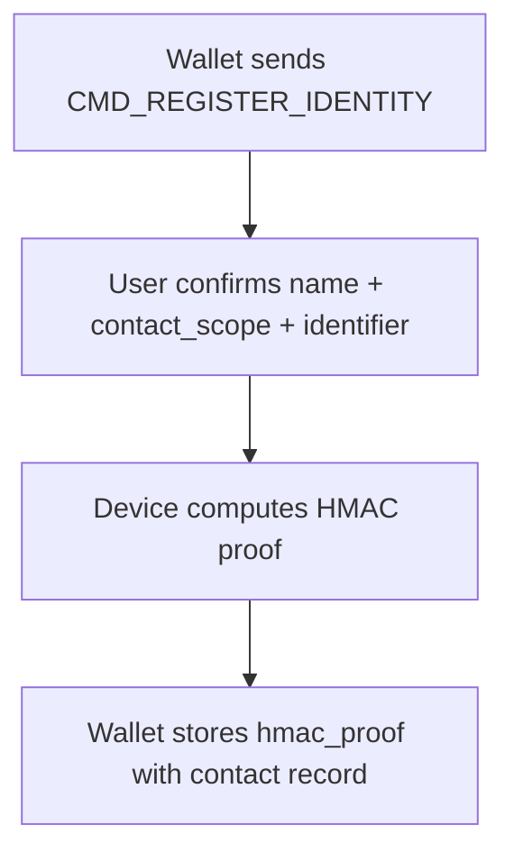
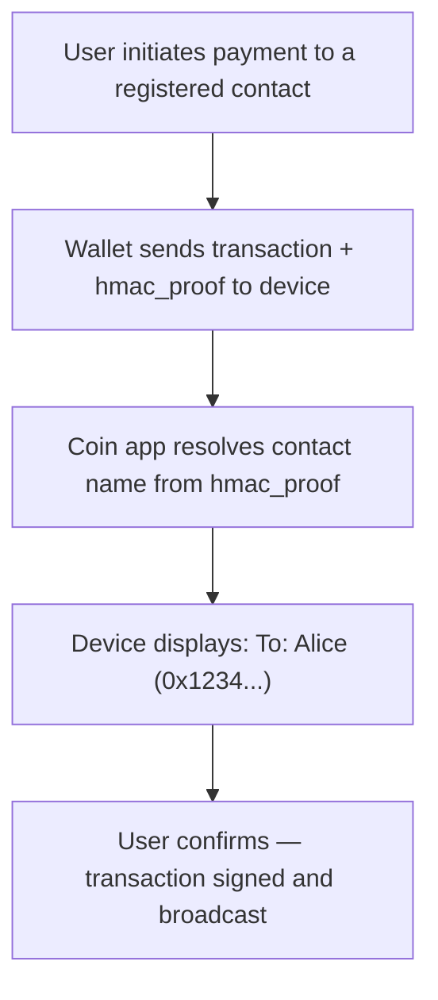
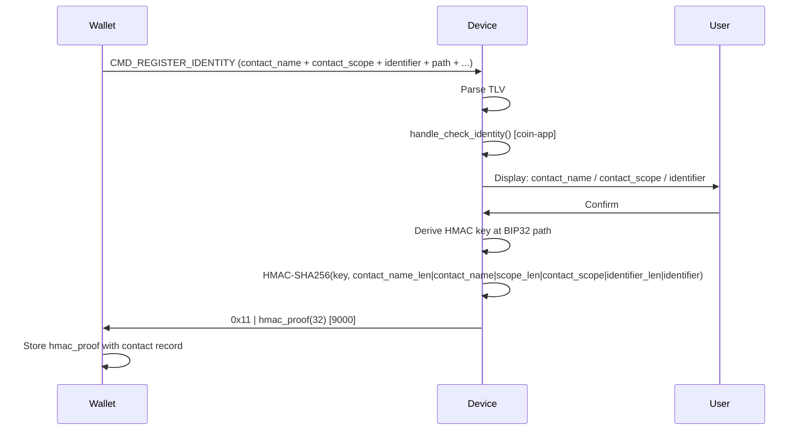
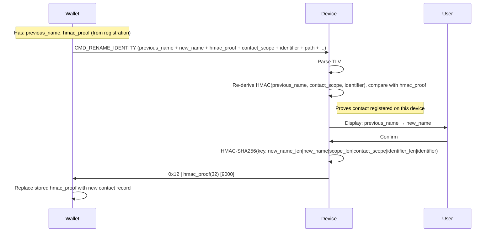
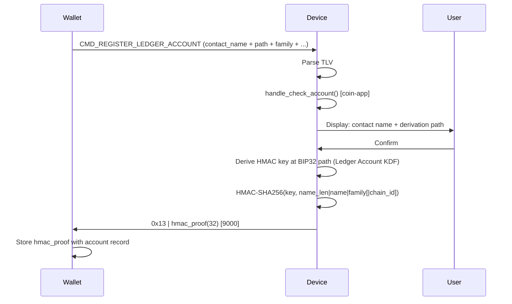
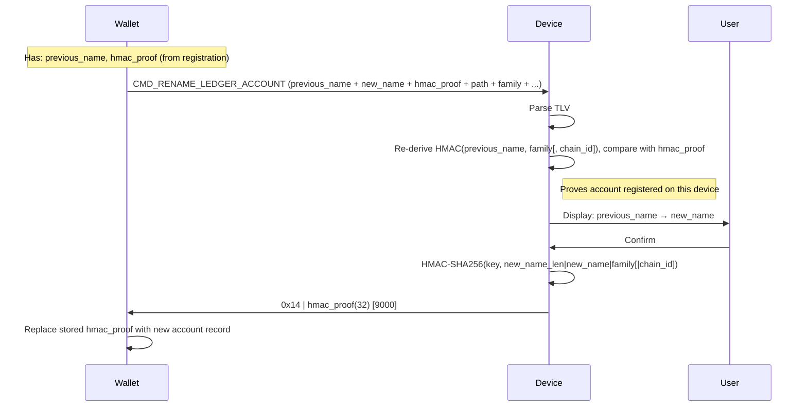

# Address Book — Implementation Specification

## Table of Contents

1. [Overview](#1-overview)
2. [App configuration](#2-app-configuration)
3. [APDU interface](#3-apdu-interface)
4. [Common foundations](#4-common-foundations)
   - 4.1 [TLV encoding](#41-tlv-encoding)
   - 4.2 [Reference tables](#42-reference-tables)
   - 4.3 [Cryptographic KDF](#43-cryptographic-kdf)
5. [Sub-commands](#5-sub-commands)
   - 5.1 [Register Identity](#51-register-identity)
   - 5.2 [Rename Identity](#52-rename-identity)
   - 5.3 [Register Ledger Account](#53-register-ledger-account)
   - 5.4 [Rename Ledger Account](#54-rename-ledger-account)
6. [Coin-app entrypoints](#6-coin-app-entrypoints)
7. [Status words](#7-status-words)

---

## 1. Overview

The **Address Book** feature allows a Ledger device to securely associate human-readable names with blockchain identifiers, so users see a familiar name rather than a raw address or public key during a transaction review.

A **Contact** is defined by three elements:

| Field               | Description                                                                     |
|---------------------|---------------------------------------------------------------------------------|
| **contact_name**    | Human-readable label (e.g. "Alice")                                             |
| **contact_scope**   | Context string identifying the network or token (e.g. "Ethereum", "BTC legacy") |
| **identifier**      | Blockchain-specific value: an address (Ethereum, Solana) or a pubkey (Bitcoin)  |

The device is stateless: it stores nothing persistently. On registration it returns a **HMAC Proof of Registration** — a 32-byte keyed hash that the wallet stores alongside the contact record.

### End-to-end use case

**Step 1 — Registration (once per contact / network):**



**Step 2 — Payment:**

At payment time, the wallet transmits the `hmac_proof` alongside the transaction data. The coin app resolves the contact name from the proof and displays it during the transaction review on the device.



---

## 2. App configuration

```makefile
# Required for all Address Book features
ENABLE_ADDRESS_BOOK = 1

# Enables "Ledger Account" features
# Not applicable to Bitcoin (UTXO model — no stable account address)
ENABLE_ADDRESS_BOOK_LEDGER_ACCOUNT = 1
```

The SDK's `Makefile.standard_app` translates each `ENABLE_*` variable into the corresponding `HAVE_*` preprocessor define.
`ENABLE_ADDRESS_BOOK_LEDGER_ACCOUNT` is nested inside the `ENABLE_ADDRESS_BOOK` block, so `HAVE_ADDRESS_BOOK_LEDGER_ACCOUNT`
can only be defined when `HAVE_ADDRESS_BOOK` is also defined.
Register Identity and Rename Identity are always active when `HAVE_ADDRESS_BOOK` is defined — they require no additional flag.

---

## 3. APDU interface

All Address Book commands share a single APDU:

```text
CLA  INS  P1          P2    Lc        Data
0xB0 0x10 <sub-cmd>   0x00  <length>  <TLV payload>
```

### Sub-command table

| P1   | Sub-command              | Guard                                                     |
|------|--------------------------|-----------------------------------------------------------|
| 0x01 | Register Identity        | `HAVE_ADDRESS_BOOK`                                       |
| 0x02 | Rename Identity          | `HAVE_ADDRESS_BOOK`                                       |
| 0x03 | Register Ledger Account  | `HAVE_ADDRESS_BOOK` && `HAVE_ADDRESS_BOOK_LEDGER_ACCOUNT` |
| 0x04 | Rename Ledger Account    | `HAVE_ADDRESS_BOOK` && `HAVE_ADDRESS_BOOK_LEDGER_ACCOUNT` |

### Multi-chunk transport

Some payloads exceed the 255-byte limit of a single short APDU (see payload size notes in §5). These are transported as multiple APDUs using a **P2-based chunking scheme**.

```text
First chunk  (P2 = 0x00):  | total_length(2, BE) | first_data_slice |
Next  chunks (P2 = 0x80):  | next_data_slice     |
```

- `total_length` is the 2-byte big-endian total size of the TLV payload (excluding the 2-byte header itself).
- Each chunk carries at most 255 bytes of APDU data (including the 2-byte length header for the first chunk).
- All intermediate chunks are answered synchronously by the device with `9000`.
- The last chunk triggers the processing and UI flow on the device; the host must await the asynchronous response.
- A payload that fits in a single chunk uses `P2 = 0x00` and is treated as a complete transfer.

---

## 4. Common foundations

### 4.1 TLV encoding

All TLV fields use BER-TLV compact encoding:

```text
Tag    (1 byte)     — see §4.2
Length (1–2 bytes)  — DER-style: value < 0x80 → 1 byte; otherwise 0x81..0x82 prefix
Value  (Length bytes)
```

Multi-byte integer values are encoded **big-endian, minimum length** (no leading zero bytes unless the value is zero itself).

### 4.2 Reference tables

#### TLV tag registry

| Tag  | Name                  | Description                                                                          |
|------|-----------------------|--------------------------------------------------------------------------------------|
| 0x01 | STRUCT_TYPE           | Structure type discriminator (see each sub-command section)                          |
| 0x02 | STRUCT_VERSION        | Structure version (currently `0x01` for all)                                         |
| 0x0A | CONTACT_NAME          | Human-readable name label (printable ASCII, max 32 chars)                            |
| 0x0B | CONTACT_SCOPE         | Context string for the identifier (printable ASCII, max 32 chars)                    |
| 0x0C | PREVIOUS_CONTACT_NAME | Previous contact name, for display and HMAC verification (Rename commands only)      |
| 0x0F | IDENTIFIER            | Blockchain identifier — address (Ethereum, Solana) or public key (Bitcoin); max 64 B |
| 0x21 | DERIVATION_PATH       | BIP32 path (packed: depth(1) + indices(4 each))                                      |
| 0x23 | CHAIN_ID              | Chain ID — mandatory for `BLOCKCHAIN_FAMILY = 1` (Ethereum); omitted for others      |
| 0x26 | HMAC_PROOF            | 32-byte HMAC-SHA256 Proof of Registration (Rename commands only)                     |
| 0x51 | BLOCKCHAIN_FAMILY     | Blockchain family (0=Bitcoin, 1=Ethereum, 2=Solana, 3=Polkadot, 4=Cosmos, 5=Cardano) |

#### STRUCT_TYPE summary

| STRUCT_TYPE | Constant                        | Sub-command             |
|-------------|---------------------------------|-------------------------|
| 0x11        | `TYPE_REGISTER_IDENTITY`        | Register Identity       |
| 0x12        | `TYPE_RENAME_IDENTITY`          | Rename Identity         |
| 0x13        | `TYPE_REGISTER_LEDGER_ACCOUNT`  | Register Ledger Account |
| 0x14        | `TYPE_RENAME_LEDGER_ACCOUNT`    | Rename Ledger Account   |

### 4.3 Cryptographic KDF

Each feature derives its HMAC key independently using a distinct domain-separation salt, preventing any cross-feature key reuse even when the same BIP32 path is used.

#### Identity KDF

```text
hmac_key = SHA256("AddressBook-Identity" || privkey.d)
```

Used by Register Identity and Rename Identity.

#### Ledger Account KDF

```text
hmac_key = SHA256("AddressBook-LedgerAccount" || privkey.d)
```

Used by Register Ledger Account and Rename Ledger Account.

---

## 5. Sub-commands

### 5.1 Register Identity

- **Sub-command:** P1 = `0x01`
- **Structure type:** `0x11` (`TYPE_REGISTER_IDENTITY`)
- **Guard:** `HAVE_ADDRESS_BOOK`

Registers a `(name, contact_scope, identifier)` tuple on the device. The `IDENTIFIER` field is blockchain-agnostic:

| Chain    | IDENTIFIER content                                      |
|----------|---------------------------------------------------------|
| Ethereum | 20-byte address                                         |
| Solana   | 32-byte base58-decoded address                          |
| Bitcoin  | 33-byte compressed public key (no stable address model) |

The response is a **HMAC Proof of Registration** that cryptographically binds the contact to this device.

#### TLV payload

| Tag Name          | Value | Mandatory | Max size | Description                                                           |
|-------------------|-------|-----------|----------|-----------------------------------------------------------------------|
| STRUCT_TYPE       | 0x01  | Yes       | 1 B      | 0x11 (`TYPE_REGISTER_IDENTITY`)                                       |
| STRUCT_VERSION    | 0x02  | Yes       | 1 B      | 0x01                                                                  |
| CONTACT_NAME      | 0x0A  | Yes       | 32 B     | Contact name (max 32 printable ASCII chars)                           |
| CONTACT_SCOPE     | 0x0B  | Yes       | 32 B     | Context string (e.g. "Ethereum", "Bitcoin legacy", "Solana USDC")     |
| IDENTIFIER        | 0x0F  | Yes       | 80 B     | Blockchain identifier (address or pubkey, chain-dependent)            |
| DERIVATION_PATH   | 0x21  | Yes       | 41 B     | BIP32 derivation path (used to derive the HMAC key)                   |
| CHAIN_ID          | 0x23  | Cond.     | 8 B      | Chain ID (mandatory for Ethereum)                                     |
| BLOCKCHAIN_FAMILY | 0x51  | Yes       | 1 B      | Blockchain family                                                     |

> **Payload size:** worst case (Ethereum, max path depth, max identifier) = **212 B** — fits in a single short APDU ✓

#### Flow

1. Parse TLV payload.
2. Call `handle_check_identity()` (coin-app entrypoint) for chain-specific validation.
3. Display to user: contact_name + contact_scope + identifier.
4. On confirm: compute HMAC Proof of Registration and return it.



#### Response (on confirm)

```text
type(1) | hmac_proof(32)
```

- `type` = `0x11` (`TYPE_REGISTER_IDENTITY`)
- `hmac_proof` = HMAC-SHA256 over: `contact_name_len(1) | contact_name | scope_len(1) | contact_scope | identifier_len(1) | identifier`

### 5.2 Rename Identity

- **Sub-command:** P1 = `0x02`
- **Structure type:** `0x12` (`TYPE_RENAME_IDENTITY`)
- **Guard:** `HAVE_ADDRESS_BOOK`

Renames an existing contact. The wallet provides the *Previous Name* and the stored `hmac_proof`, allowing the device to verify the prior registration, display `old_name → new_name` to the user, and return a new proof for the updated name.

> **Note:** This command involves no blockchain-specific logic — HMAC verification and name display are generic operations. It could therefore be handled directly by the OS rather than delegated to the coin app.

#### TLV payload

| Tag Name              | Value | Mandatory | Max size | Description                                                           |
|-----------------------|-------|-----------|----------|-----------------------------------------------------------------------|
| STRUCT_TYPE           | 0x01  | Yes       | 1 B      | 0x12 (`TYPE_RENAME_IDENTITY`)                                         |
| STRUCT_VERSION        | 0x02  | Yes       | 1 B      | 0x01                                                                  |
| PREVIOUS_CONTACT_NAME | 0x0C  | Yes       | 32 B     | Previous contact name (must match value used at registration)         |
| CONTACT_NAME          | 0x0A  | Yes       | 32 B     | New contact name (max 32 printable ASCII chars)                       |
| CONTACT_SCOPE         | 0x0B  | Yes       | 32 B     | Context string (unchanged from registration)                          |
| IDENTIFIER            | 0x0F  | Yes       | 80 B     | Blockchain identifier (unchanged from registration)                   |
| HMAC_PROOF            | 0x26  | Yes       | 32 B     | HMAC Proof of Registration returned by the original Register Identity |
| DERIVATION_PATH       | 0x21  | Yes       | 41 B     | BIP32 derivation path (same as at registration)                       |
| CHAIN_ID              | 0x23  | Cond.     | 8 B      | Chain ID (mandatory for Ethereum)                                     |
| BLOCKCHAIN_FAMILY     | 0x51  | Yes       | 1 B      | Blockchain family                                                     |

> **Payload size:** worst case (Ethereum, max path depth, max identifier) = **280 B** — exceeds the 255 B short APDU limit. Multi-chunk transport is required (see §3).

#### Flow

1. Parse TLV payload.
2. Re-derive HMAC over `(previous_name, contact_scope, identifier)` and compare with `hmac_proof` (constant-time) — proves the contact was registered on this device.
3. Display to user: `previous_name → new_name`.
4. On confirm: compute new HMAC over `(new_name, contact_scope, identifier)` and return it.



#### Response (on confirm)

```text
type(1) | hmac_proof(32)
```

- `type` = `0x12` (`TYPE_RENAME_IDENTITY`)
- `hmac_proof` = new HMAC-SHA256 over: `new_name_len(1) | new_name | scope_len(1) | contact_scope | identifier_len(1) | identifier`

### 5.3 Register Ledger Account

- **Sub-command:** P1 = `0x03`
- **Structure type:** `0x13` (`TYPE_REGISTER_LEDGER_ACCOUNT`)
- **Guard:** `HAVE_ADDRESS_BOOK` && `HAVE_ADDRESS_BOOK_LEDGER_ACCOUNT`

Registers a name for a Ledger-owned account, identified by its derivation path and blockchain family. `CHAIN_ID` is only present for Ethereum, where multiple networks share the same address format.

#### TLV payload

| Tag Name          | Value | Mandatory | Max size | Description                                 |
|-------------------|-------|-----------|----------|---------------------------------------------|
| STRUCT_TYPE       | 0x01  | Yes       | 1 B      | 0x13 (`TYPE_REGISTER_LEDGER_ACCOUNT`)       |
| STRUCT_VERSION    | 0x02  | Yes       | 1 B      | 0x01                                        |
| CONTACT_NAME      | 0x0A  | Yes       | 32 B     | Account name (max 32 printable ASCII chars) |
| DERIVATION_PATH   | 0x21  | Yes       | 41 B     | BIP32 derivation path                       |
| CHAIN_ID          | 0x23  | Cond.     | 8 B      | Chain ID (mandatory for Ethereum)           |
| BLOCKCHAIN_FAMILY | 0x51  | Yes       | 1 B      | Blockchain family                           |

> **Payload size:** worst case (Ethereum, max path depth) = **96 B** — fits in a single short APDU ✓

#### Flow

1. Parse TLV payload.
2. Call `handle_check_account()` (coin-app entrypoint).
3. Display contact name + derivation path to user.
4. On confirm: compute HMAC Proof of Registration and return it.



#### Response (on confirm)

```text
type(1) | hmac_proof(32)
```

- `type` = `0x13` (`TYPE_REGISTER_LEDGER_ACCOUNT`)
- `hmac_proof` = HMAC-SHA256 over: `contact_name_len(1) | contact_name | family(1) [ | chain_id(8) ]`

  > `chain_id` is included in the HMAC message only when `BLOCKCHAIN_FAMILY = 1` (Ethereum).

### 5.4 Rename Ledger Account

- **Sub-command:** P1 = `0x04`
- **Structure type:** `0x14` (`TYPE_RENAME_LEDGER_ACCOUNT`)
- **Guard:** `HAVE_ADDRESS_BOOK` && `HAVE_ADDRESS_BOOK_LEDGER_ACCOUNT`

Renames an existing Ledger account. The wallet provides the previous name and the stored `hmac_proof`, allowing the device to verify the prior registration, display `old_name → new_name` to the user, and return a new proof for the updated name.

> **Note:** This command involves no blockchain-specific logic — HMAC verification and name display are generic operations. It could therefore be handled directly by the OS rather than delegated to the coin app.

#### TLV payload

| Tag Name              | Value | Mandatory | Max size | Description                                                           |
|-----------------------|-------|-----------|----------|-----------------------------------------------------------------------|
| STRUCT_TYPE           | 0x01  | Yes       | 1 B      | 0x14 (`TYPE_RENAME_LEDGER_ACCOUNT`)                                   |
| STRUCT_VERSION        | 0x02  | Yes       | 1 B      | 0x01                                                                  |
| PREVIOUS_CONTACT_NAME | 0x0C  | Yes       | 32 B     | Previous account name (must match value used at registration)         |
| CONTACT_NAME          | 0x0A  | Yes       | 32 B     | New account name (max 32 printable ASCII chars)                       |
| HMAC_PROOF            | 0x26  | Yes       | 32 B     | HMAC Proof of Registration returned by Register Ledger Account        |
| DERIVATION_PATH       | 0x21  | Yes       | 41 B     | BIP32 derivation path (same as at registration)                       |
| CHAIN_ID              | 0x23  | Cond.     | 8 B      | Chain ID (mandatory for Ethereum)                                     |
| BLOCKCHAIN_FAMILY     | 0x51  | Yes       | 1 B      | Blockchain family                                                     |

> **Payload size:** worst case (Ethereum, max path depth) = **164 B** — fits in a single short APDU ✓

#### Flow

1. Parse TLV payload.
2. Re-derive HMAC over `(previous_name, family [, chain_id])` and compare with `hmac_proof` (constant-time) — proves the account was registered on this device.
3. Display `previous_name → new_name` to user.
4. On confirm: compute new HMAC over `(new_name, family [, chain_id])` and return it.



#### Response (on confirm)

```text
type(1) | hmac_proof(32)
```

- `type` = `0x14` (`TYPE_RENAME_LEDGER_ACCOUNT`)
- `hmac_proof` = new HMAC-SHA256 over: `name_len(1) | new_name | family(1) [ | chain_id(8) ]`

---

## 6. Coin-app entrypoints

| Entrypoint                       | Signature              | Guard                              | Called when                            | Expected return                      |
|----------------------------------|------------------------|------------------------------------|----------------------------------------|--------------------------------------|
| `handle_check_identity`          | `(identity_t *)`       | `HAVE_ADDRESS_BOOK`                | Before displaying Register Identity    | `true` to proceed, `false` to reject |
| `get_register_identity_tagValue` | `(pair *, index)`      | `HAVE_ADDRESS_BOOK`                | NBGL tag-value callback during review  | Fills pair for display               |
| `finalize_ui_register_identity`  | `(void)`               | `HAVE_ADDRESS_BOOK`                | After user choice                      | Cleanup + return to idle             |
| `handle_check_account`           | `(ledger_account_t *)` | `HAVE_ADDRESS_BOOK_LEDGER_ACCOUNT` | Before displaying Register Ledger Acct | `true` to proceed, `false` to reject |
| `get_ledger_account_tagValue`    | `(pair *, index)`      | `HAVE_ADDRESS_BOOK_LEDGER_ACCOUNT` | NBGL tag-value callback                | Fills pair for display               |
| `finalize_ui_ledger_account`     | `(void)`               | `HAVE_ADDRESS_BOOK_LEDGER_ACCOUNT` | After user choice                      | Cleanup + return to idle             |

---

## 7. Status words

| Value  | Constant                               | Meaning                                                  |
|--------|----------------------------------------|----------------------------------------------------------|
| 0x9000 | `SWO_SUCCESS`                          | Operation successful                                     |
| 0x6A80 | `SWO_INCORRECT_DATA`                   | Malformed TLV, user rejection, or failed HMAC            |
| 0x6982 | `SWO_SECURITY_CONDITION_NOT_SATISFIED` | HMAC verification failed                                 |
| 0x6984 | `SWO_CONDITIONS_NOT_SATISFIED`         | Unknown sub-command or unsupported configuration         |
| 0x6B00 | `SWO_WRONG_PARAMETER_VALUE`            | Coin-app rejected the data (chain, address format, etc.) |
