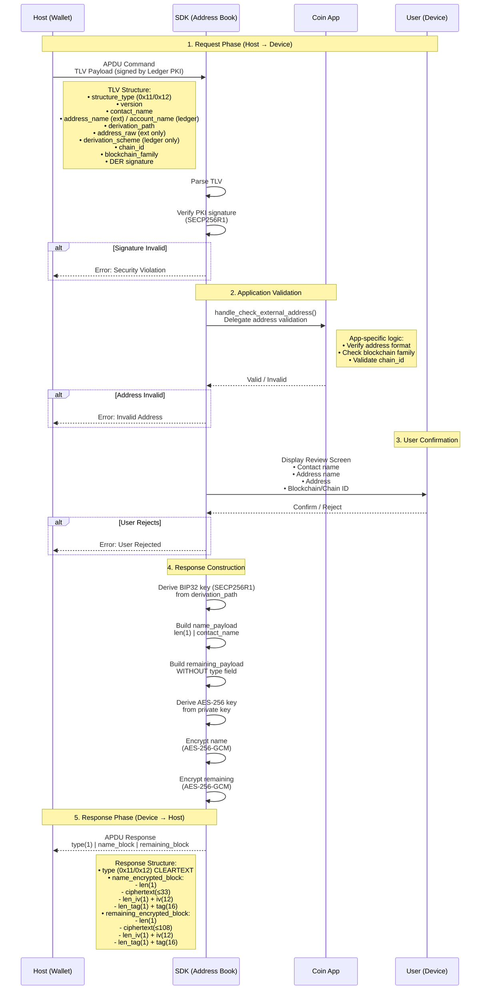

# Address Book Flow

> **Note**: This is a standalone Markdown version of the Address Book flow documentation.
> For the Doxygen-generated documentation, see `mainpage.dox`.

## Command Flow: Add External Address / Ledger Account



## Data Flow Summary

### Input (Host → Device)

```text
TLV Payload (Signed by Ledger PKI)
├── structure_type: 0x11 (External) or 0x12 (Ledger)
├── version: 0x01
├── contact_name: string (max 32 bytes)
├── address_name/account_name: string (max 32 bytes)
├── derivation_path: BIP32 path
├── [address_raw: binary (max 64 bytes)] - External only
├── [derivation_scheme: uint8] - Ledger accounts only
├── [chain_id: uint64] - Required for Ethereum family
├── [blockchain_family: uint8] - Required for all types
└── signature: DER ECDSA (70-72 bytes)
```

### SDK Processing

1. **Parse & Verify**: TLV parsing + PKI signature verification
2. **Delegate**: Call app-specific validation (`handle_check_external_address`)
3. **UI**: Display review screen for user confirmation
4. **Crypto**:
   - Derive SECP256R1 key from `derivation_path`
   - Derive AES-256 key from private key
   - Encrypt both payloads with AES-256-GCM

### Output (Device → Host)

```text
APDU Response
├── type: 0x11 or 0x12 (CLEARTEXT)
├── name_encrypted_block:
│   ├── len(1)
│   ├── ciphertext: AES-GCM(len(1) | name)
│   ├── len_iv(1) + iv(12)
│   └── len_tag(1) + tag(16)
└── remaining_encrypted_block:
    ├── len(1)
    ├── ciphertext: AES-GCM(remaining_data)
    │   External: len(1) | address_name | len(1) | address_raw | chain_id(8) | family(1)
    │   Ledger: len(1) | derivation_path(40) | derivation_scheme(1) | chain_id(8) | family(1)
    ├── len_iv(1) + iv(12)
    └── len_tag(1) + tag(16)
```

## Key Design Decisions

1. **Type in Cleartext**: Host can identify message type before decryption
2. **Dual Encryption**: Name and remaining data encrypted separately for modularity
3. **BIP32 Derivation**: Path used for encryption key derivation
4. **PKI Verification**: Input verified with Ledger PKI (SECP256R1)
5. **App Validation**: Coin-specific logic delegated to app via callback
6. **User Confirmation**: Mandatory review screen before sending response
