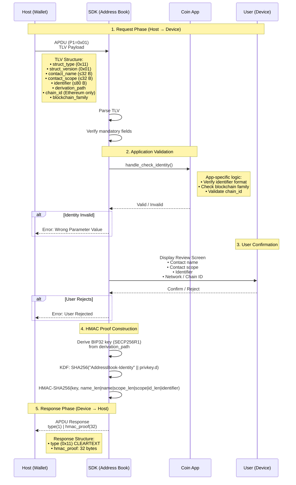
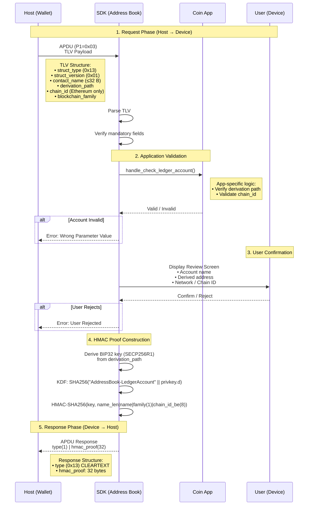

# Address Book Flow

> **Note**: This is a standalone Markdown version of the Address Book flow documentation.
> For the Doxygen-generated documentation, see `mainpage.dox`.

## Sub-Commands Overview

The Address Book APDU (CLA=0xB0, INS=0x10) dispatches on P1:

| P1   | Sub-command             | Struct type |
|------|-------------------------|-------------|
| 0x01 | Register Identity       | 0x11        |
| 0x02 | Rename Identity         | 0x12        |
| 0x03 | Register Ledger Account | 0x13        |
| 0x04 | Rename Ledger Account   | 0x14        |

---

## Command Flow: Register Identity (P1=0x01)



---

## Command Flow: Register Ledger Account (P1=0x03)



---

## Data Flow Summary

### TLV Tags

| Tag  | Name                  | Description                               | Max size |
|------|-----------------------|-------------------------------------------|----------|
| 0x01 | STRUCT_TYPE           | Sub-command type (0x11–0x14)              | 1 B      |
| 0x02 | STRUCT_VERSION        | Always 0x01                               | 1 B      |
| 0x0A | CONTACT_NAME          | Human-readable contact/account name       | 32 B     |
| 0x0B | CONTACT_SCOPE         | Scope/namespace for the identifier        | 32 B     |
| 0x0C | PREVIOUS_CONTACT_NAME | Previous name (Rename commands only)      | 32 B     |
| 0x0F | IDENTIFIER            | Opaque identifier (e.g. Ethereum address) | 80 B     |
| 0x21 | DERIVATION_PATH       | BIP32 path for HMAC key derivation        | 43 B     |
| 0x23 | CHAIN_ID              | Chain ID (mandatory for Ethereum family)  | 8 B      |
| 0x26 | HMAC_PROOF            | HMAC proof (Rename commands only)         | 32 B     |
| 0x51 | BLOCKCHAIN_FAMILY     | Blockchain family enum                    | 1 B      |

### Register Identity Input (P1=0x01)

```text
TLV Payload
├── struct_type:       0x11
├── struct_version:    0x01
├── contact_name:      string (max 32 bytes, printable ASCII)
├── contact_scope:     string (max 32 bytes, printable ASCII)  ← mandatory
├── identifier:        binary (max 80 bytes)
├── derivation_path:   BIP32 path
├── [chain_id:         uint64]   ← mandatory for FAMILY_ETHEREUM
└── blockchain_family: uint8
```

### Register Ledger Account Input (P1=0x03)

```text
TLV Payload
├── struct_type:       0x13
├── struct_version:    0x01
├── contact_name:      string (max 32 bytes, printable ASCII)
├── derivation_path:   BIP32 path
├── [chain_id:         uint64]   ← mandatory for FAMILY_ETHEREUM
└── blockchain_family: uint8
```

### SDK Processing

1. **Parse**: TLV parsing and mandatory field verification
2. **Delegate**: Call app-specific validation callback
3. **UI**: Display review screen for user confirmation
4. **Crypto**:
   - Derive SECP256R1 private key from `derivation_path`
   - KDF: `SHA256(salt || privkey.d)` where salt is "AddressBook-Identity" or "AddressBook-LedgerAccount"
   - `HMAC-SHA256(key, message)` — message depends on sub-command (see below)

### HMAC Message Construction

**Identity (0x11)**:

```text
name_len(1) | contact_name | scope_len(1) | contact_scope | id_len(1) | identifier
```

**Ledger Account (0x13)**:

```text
name_len(1) | account_name | blockchain_family(1) [| chain_id_be(8)]
```

`chain_id_be(8)` is included only for `FAMILY_ETHEREUM`.

### Output (Device → Host)

```text
APDU Response
├── type:       0x11 / 0x12 / 0x13 / 0x14 (CLEARTEXT)
└── hmac_proof: 32 bytes (HMAC-SHA256)
```

---

## Key Design Decisions

1. **Type in Cleartext**: Host can identify the sub-command before processing the response
2. **HMAC Proof**: Cryptographically binds the user's on-device confirmation to the
   (name, scope/path, identifier/family, chain_id) tuple
3. **Dual KDF**: Separate salts for Identity and Ledger Account prevent cross-feature
   key reuse even at the same BIP32 derivation path
4. **No secrets leave the device**: BIP32 private key and HMAC key are computed
   on-device and never transmitted to the host
5. **App Validation**: Coin-specific logic delegated to the application via callback
6. **User Confirmation**: Mandatory review screen before the HMAC proof is sent
