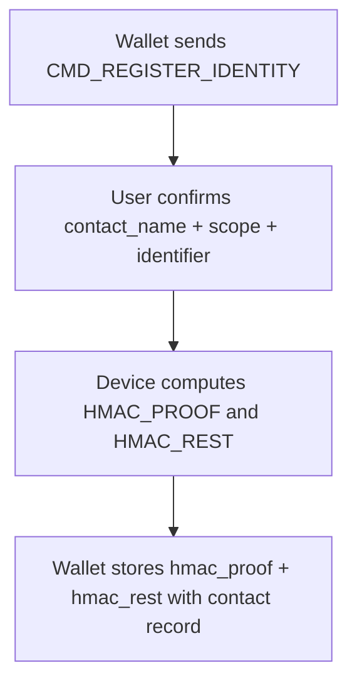
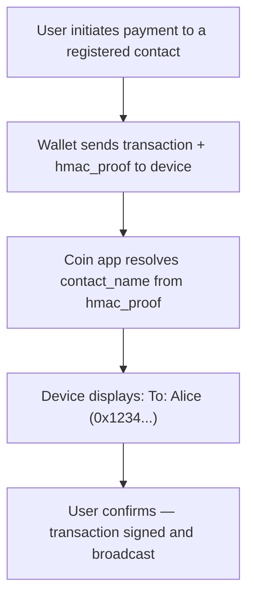
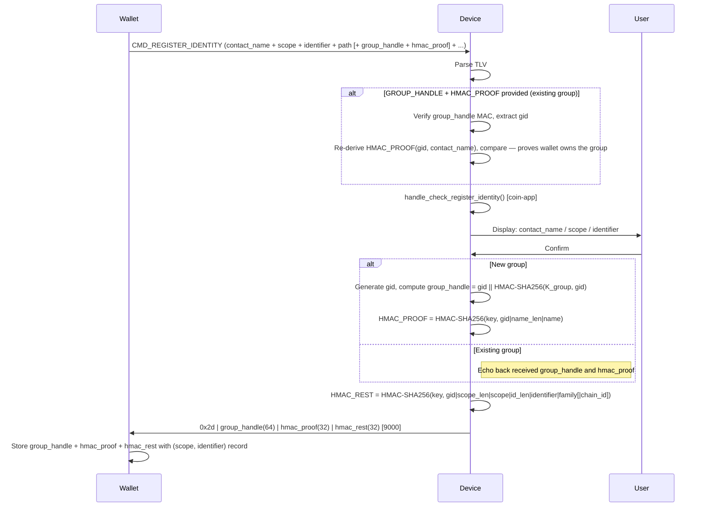
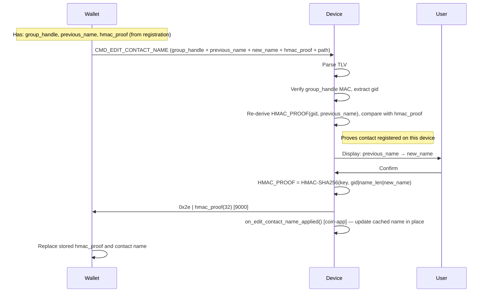
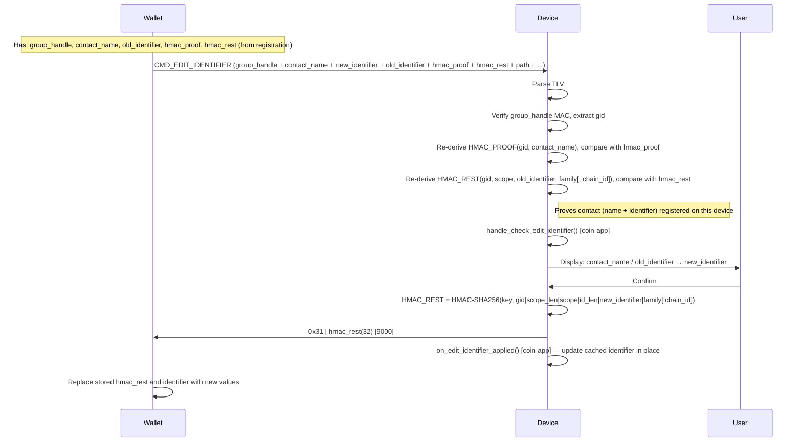
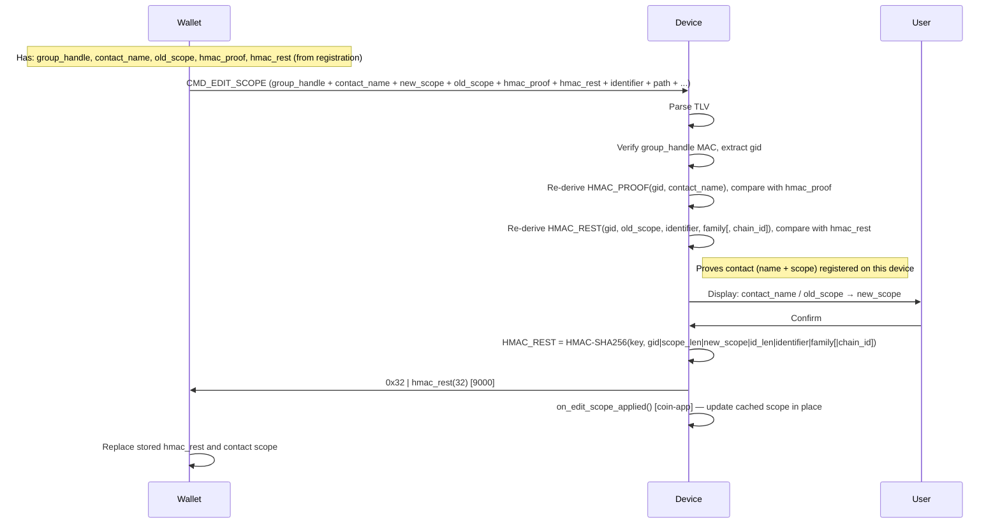
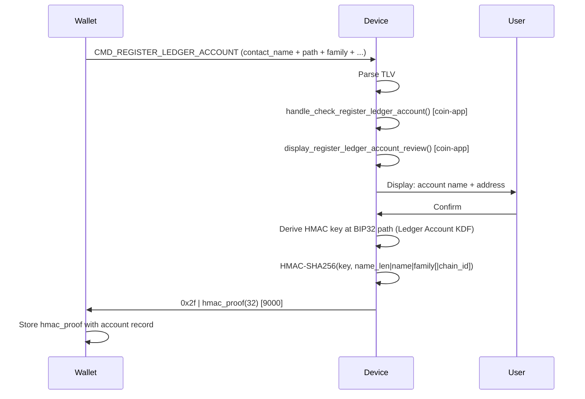
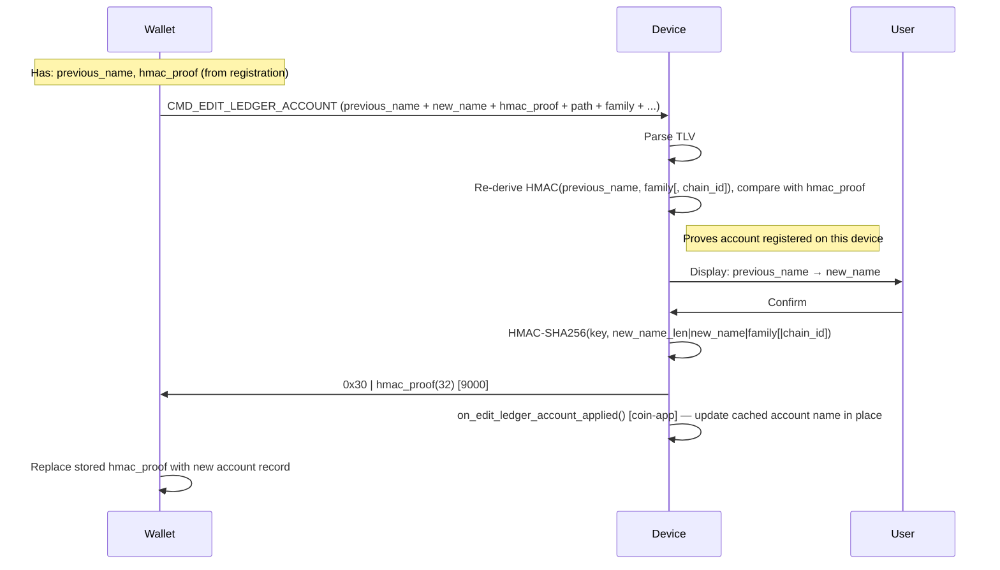
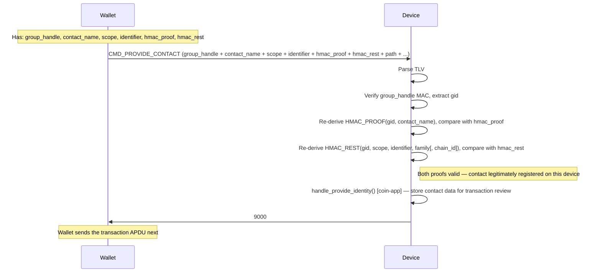
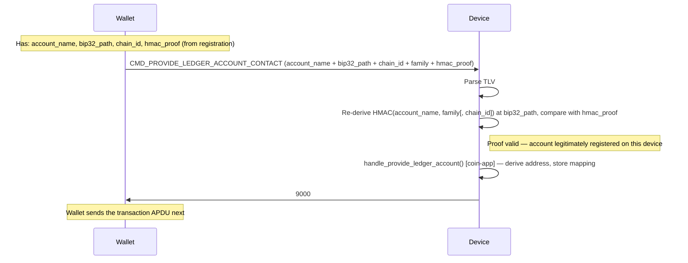

# Address Book — Implementation Specification

## Table of Contents

1. [Overview](#1-overview)
2. [App configuration](#2-app-configuration)
3. [APDU interface](#3-apdu-interface)
4. [Common foundations](#4-common-foundations)
   - 4.1 [TLV encoding](#41-tlv-encoding)
   - 4.2 [Reference tables](#42-reference-tables)
   - 4.3 [Cryptographic KDF](#43-cryptographic-kdf)
5. [Sub-commands](#5-sub-commands)
   - 5.1 [Register Identity](#51-register-identity)
   - 5.2 [Edit Contact Name](#52-edit-contact-name)
   - 5.3 [Edit Identifier](#53-edit-identifier)
   - 5.4 [Edit Scope](#54-edit-scope)
   - 5.5 [Register Ledger Account](#55-register-ledger-account)
   - 5.6 [Edit Ledger Account](#56-edit-ledger-account)
   - 5.7 [Provide Contact](#57-provide-contact)
   - 5.8 [Provide Ledger Account Contact](#58-provide-ledger-account-contact)
6. [Coin-app entrypoints](#6-coin-app-entrypoints)
7. [Status words](#7-status-words)

---

## 1. Overview

The **Address Book** feature allows a Ledger device to securely associate human-readable names with blockchain identifiers, so users see a familiar name rather than a raw address or public key during a transaction review.

A **Contact** is defined by three elements:

| Field               | Description                                                                     |
|---------------------|---------------------------------------------------------------------------------|
| **contact_name**    | Human-readable label (e.g. "Alice")                                             |
| **scope**           | Context string identifying the network or token (e.g. "Ethereum", "BTC legacy") |
| **identifier**      | Blockchain-specific value: an address (Ethereum, Solana) or a pubkey (Bitcoin)  |

The device is stateless: it stores nothing persistently. On registration it generates a random **Group ID** (`gid`, 32 bytes), authenticates it with a device key as a `group_handle` (64 bytes), and returns two independent **HMAC Proofs of Registration** — `HMAC_PROOF` (covers the contact name) and `HMAC_REST` (covers scope, identifier, and network) — that the wallet stores alongside the contact record alongside the `group_handle`. Having two independent proofs allows the wallet to later rename a contact without needing to re-present the identifier or scope.

### End-to-end use case

**Step 1 — Registration (once per contact / network):**



**Step 2 — Payment:**

At payment time, the wallet transmits the `hmac_proof` alongside the transaction data. The coin app resolves the contact name from the proof and displays it during the transaction review on the device.



---

## 2. App configuration

```makefile
# Required for all Address Book features
ENABLE_ADDRESS_BOOK = 1

# Enables "Ledger Account" features
# Not applicable to Bitcoin (UTXO model — no stable account address)
ENABLE_ADDRESS_BOOK_LEDGER_ACCOUNT = 1
```

The SDK's `Makefile.standard_app` translates each `ENABLE_*` variable into the corresponding `HAVE_*` preprocessor define.
`ENABLE_ADDRESS_BOOK_LEDGER_ACCOUNT` is nested inside the `ENABLE_ADDRESS_BOOK` block, so `HAVE_ADDRESS_BOOK_LEDGER_ACCOUNT`
can only be defined when `HAVE_ADDRESS_BOOK` is also defined.
Register Identity, Edit Contact Name, Edit Identifier, and Edit Scope are always active when `HAVE_ADDRESS_BOOK` is defined — they require no additional flag.

---

## 3. APDU interface

All Address Book commands share the same APDU layout:

```text
CLA  INS  P1          P2            Lc           Data
0xB0 0x10 <sub-cmd>   0x00 | 0x80   <chunk_len>  <chunk>
```

P1 selects the sub-command; P2 is the chunk flag (`0x00` first chunk, `0x80`
continuation). The payload is always carried with the chunked framing described
below, even when it fits in a single chunk.

### Sub-command table

| P1   | Sub-command                    | Guard                                                     |
|------|--------------------------------|-----------------------------------------------------------|
| 0x01 | Register Identity              | `HAVE_ADDRESS_BOOK`                                       |
| 0x02 | Edit Contact Name              | `HAVE_ADDRESS_BOOK`                                       |
| 0x03 | Edit Identifier                | `HAVE_ADDRESS_BOOK`                                       |
| 0x04 | Edit Scope                     | `HAVE_ADDRESS_BOOK`                                       |
| 0x11 | Register Ledger Account        | `HAVE_ADDRESS_BOOK` && `HAVE_ADDRESS_BOOK_LEDGER_ACCOUNT` |
| 0x12 | Edit Ledger Account            | `HAVE_ADDRESS_BOOK` && `HAVE_ADDRESS_BOOK_LEDGER_ACCOUNT` |
| 0x20 | Provide Contact                | `HAVE_ADDRESS_BOOK`                                       |
| 0x21 | Provide Ledger Account Contact | `HAVE_ADDRESS_BOOK` && `HAVE_ADDRESS_BOOK_LEDGER_ACCOUNT` |

### Chunked transport

**Every** command — regardless of payload size — uses the same **P2-based chunking scheme**.
A single uniform format avoids special-casing small payloads and eases future evolutions (e.g. larger payloads on new chains).

```text
First chunk  (P2 = 0x00):  | total_length(2, BE) | first_data_slice |
Next  chunks (P2 = 0x80):  | next_data_slice     |
```

- `total_length` is the 2-byte big-endian total size of the TLV payload (excluding the 2-byte header itself).
- Each chunk carries at most 255 bytes of APDU data (including the 2-byte length header for the first chunk).
- All intermediate chunks are answered synchronously by the device with `9000`.
- The last chunk triggers the processing and UI flow on the device; the host must await the asynchronous response.
- A payload that fits in a single chunk uses `P2 = 0x00` and is a complete transfer (still prefixed with its 2-byte `total_length`).

Payloads that exceed 255 bytes simply span several chunks; the framing is identical to the single-chunk case. The largest payloads (see size notes in §5) are:

- **Edit Identifier** (§5.3, up to 428 B)
- **Edit Scope** (§5.4, up to 380 B)
- **Provide Contact** (§5.7, up to 362 B)
- **Register Identity** (§5.1, up to 312 B) when `GROUP_HANDLE` + `HMAC_PROOF` are present and the identifier exceeds ~38 bytes (non-Ethereum chains)

---

## 4. Common foundations

### 4.1 TLV encoding

All TLV fields use BER-TLV compact encoding:

```text
Tag    (1 byte)     — see §4.2
Length (1–2 bytes)  — DER-style: value < 0x80 → 1 byte; otherwise 0x81..0x82 prefix
Value  (Length bytes)
```

Multi-byte integer values are encoded **big-endian, minimum length** (no leading zero bytes unless the value is zero itself).

### 4.2 Reference tables

#### TLV tag registry

| Tag  | Name                   | Description                                                                           |
|------|------------------------|---------------------------------------------------------------------------------------|
| 0x01 | STRUCT_TYPE            | Structure type discriminator (see each sub-command section)                           |
| 0x02 | STRUCT_VERSION         | Structure version (currently `0x01` for all)                                          |
| 0xf0 | CONTACT_NAME           | Human-readable name label (printable ASCII, max 32 chars)                             |
| 0xf1 | SCOPE                  | Context string for the identifier (printable ASCII, max 32 chars)                     |
| 0xf2 | ACCOUNT_IDENTIFIER     | Blockchain identifier — address (Ethereum, Solana) or public key (Bitcoin); max 80 B  |
| 0xf3 | PREVIOUS_CONTACT_NAME  | Old contact name, for display and HMAC verification (Edit Contact Name only)          |
| 0xf4 | PREVIOUS_IDENTIFIER    | Old identifier, for HMAC verification (Edit Identifier only)                          |
| 0xf5 | PREVIOUS_SCOPE         | Old scope, for display and HMAC verification (Edit Scope only)                        |
| 0xf6 | GROUP_HANDLE           | Device-generated opaque token: `gid(32) + HMAC-SHA256(K_group, gid)(32)`; see §4.3    |
| 0x21 | DERIVATION_PATH        | BIP32 path (packed: depth(1) + indices(4 each))                                       |
| 0x23 | CHAIN_ID               | Chain ID — mandatory for `BLOCKCHAIN_FAMILY = 1` (Ethereum); omitted for others       |
| 0x51 | BLOCKCHAIN_FAMILY      | Blockchain family (0=Bitcoin, 1=Ethereum, 2=Solana, 3=Polkadot, 4=Cosmos, 5=Cardano)  |
| 0x29 | HMAC_PROOF             | 32-byte HMAC-SHA256 name-binding proof: covers `gid(32) + name` (§4.3)                |
| 0xf7 | HMAC_REST              | 32-byte HMAC-SHA256 over `(gid(32), scope, identifier, family[, chain_id])` (§4.3)    |

#### STRUCT_TYPE summary

| STRUCT_TYPE | Constant                              | Sub-command                    |
|-------------|---------------------------------------|--------------------------------|
| 0x2d        | `TYPE_REGISTER_IDENTITY`              | Register Identity              |
| 0x2e        | `TYPE_EDIT_CONTACT_NAME`              | Edit Contact Name              |
| 0x2f        | `TYPE_REGISTER_LEDGER_ACCOUNT`        | Register Ledger Account        |
| 0x30        | `TYPE_EDIT_LEDGER_ACCOUNT`            | Edit Ledger Account            |
| 0x31        | `TYPE_EDIT_IDENTIFIER`                | Edit Identifier                |
| 0x32        | `TYPE_EDIT_SCOPE`                     | Edit Scope                     |
| 0x33        | `TYPE_PROVIDE_CONTACT`                | Provide Contact                |
| 0x34        | `TYPE_PROVIDE_LEDGER_ACCOUNT_CONTACT` | Provide Ledger Account Contact |

### 4.3 Cryptographic KDF

Each feature derives its HMAC key independently using a distinct domain-separation salt, preventing any cross-feature key reuse even when the same BIP32 path is used.

#### Group Handle

At registration the device generates a random 32-byte **Group ID** (`gid`) and authenticates it with a separate device key:

```text
K_group      = HMAC-SHA256("AddressBook-Group" || privkey.d, "")  [via SHA256 KDF]
group_handle = gid(32) | HMAC-SHA256(K_group, gid)(32)
```

The device returns `group_handle` (64 bytes) to the wallet, which stores it opaquely alongside the contact record. For each subsequent Edit operation the wallet re-sends the full `group_handle`; the device recomputes the MAC, verifies it in constant time, and — only on success — extracts `gid` to authenticate the HMAC proofs.

This design prevents **proof splicing**: because the wallet cannot fabricate a valid `group_handle` for an arbitrary `gid`, it cannot mix `HMAC_PROOF` from one registered contact with `HMAC_REST` from another.

#### Identity KDF

Both Identity HMACs share the same KDF:

```text
hmac_key = SHA256("AddressBook-Identity" || privkey.d)
```

**HMAC_PROOF** covers the contact name only. Used by Register Identity (computed), Edit Contact Name (verified then re-computed).

```text
message = gid(32) | name_len(1) | contact_name
```

**HMAC_REST** — covers scope, identifier, and network. Used by Register Identity (computed), Edit Identifier (verified then re-computed), and Edit Scope (verified then re-computed).

```text
message = gid(32) | scope_len(1) | scope | id_len(1) | identifier | family(1) [ | chain_id(8) ]
```

> `chain_id` is included only when `BLOCKCHAIN_FAMILY = 1` (Ethereum).

Register Identity returns `group_handle`, `HMAC_PROOF`, and `HMAC_REST`. Edit sub-commands receive `group_handle` and both proofs so the device can independently verify the contact binding.
The tag `HMAC_PROOF` is also used by Ledger Account commands (single HMAC, same tag value, different KDF).

#### Ledger Account KDF

```text
hmac_key = SHA256("AddressBook-LedgerAccount" || privkey.d)
```

Used by Register Ledger Account, Edit Ledger Account, and Provide Ledger Account Contact.

---

## 5. Sub-commands

### 5.1 Register Identity

- **Sub-command:** P1 = `0x01`
- **Structure type:** `0x2d` (`TYPE_REGISTER_IDENTITY`)
- **Guard:** `HAVE_ADDRESS_BOOK`

Registers a `(name, scope, identifier)` tuple on the device. The `ACCOUNT_IDENTIFIER` field is blockchain-agnostic:

| Chain    | IDENTIFIER content                                      |
|----------|---------------------------------------------------------|
| Ethereum | 20-byte address                                         |
| Solana   | 32-byte base58-decoded address                          |
| Bitcoin  | 33-byte compressed public key (no stable address model) |

The response contains two independent **HMAC Proofs of Registration** (`HMAC_PROOF` and `HMAC_REST`) that cryptographically bind the contact to this device.

#### Two operating modes

**New group (default):** `GROUP_HANDLE` and `HMAC_PROOF` are omitted. The device generates a fresh `gid`, computes a new `group_handle`, and returns `group_handle + HMAC_PROOF + HMAC_REST`. The wallet stores all three alongside the first `(scope, identifier)` record.

**Link to existing group (optional):** `GROUP_HANDLE` and `HMAC_PROOF` are both provided. The device verifies the `group_handle` MAC and the `HMAC_PROOF` (proving the wallet owns the contact), then computes only a new `HMAC_REST` for the new `(scope, identifier)`. The response echoes back the same `group_handle` and `HMAC_PROOF`, with a freshly computed `HMAC_REST`.

> Both optional tags must be present together or both absent — providing only one is rejected.

This allows a wallet to register multiple addresses for the same contact (e.g. the same person's Ethereum Mainnet and Base addresses) under a single `group_handle`. A subsequent rename via Edit Contact Name then invalidates the shared `HMAC_PROOF` for all addresses at once.

#### TLV payload

| Tag Name           | Value | Mandatory | Max size | Description                                                                          |
|--------------------|-------|-----------|----------|--------------------------------------------------------------------------------------|
| STRUCT_TYPE        | 0x01  | Yes       | 1 B      | 0x2d (`TYPE_REGISTER_IDENTITY`)                                                      |
| STRUCT_VERSION     | 0x02  | Yes       | 1 B      | 0x01                                                                                 |
| CONTACT_NAME       | 0xf0  | Yes       | 32 B     | Contact name (max 32 printable ASCII chars)                                          |
| SCOPE              | 0xf1  | Yes       | 32 B     | Context string (e.g. "Ethereum", "Bitcoin legacy", "Solana USDC")                    |
| ACCOUNT_IDENTIFIER | 0xf2  | Yes       | 80 B     | Blockchain identifier (address or pubkey, chain-dependent)                           |
| DERIVATION_PATH    | 0x21  | Yes       | 41 B     | BIP32 derivation path (used to derive the HMAC key)                                  |
| CHAIN_ID           | 0x23  | Cond.     | 8 B      | Chain ID (mandatory for Ethereum)                                                    |
| BLOCKCHAIN_FAMILY  | 0x51  | Yes       | 1 B      | Blockchain family                                                                    |
| GROUP_HANDLE       | 0xf6  | Optional  | 64 B     | Existing group handle — links this identifier to an existing contact group           |
| HMAC_PROOF         | 0x29  | Optional  | 32 B     | `HMAC_PROOF` for the existing group — required when `GROUP_HANDLE` is present        |

> **Payload size (new group):** worst case (max identifier, max path depth) = **212 B** — fits in a single short APDU ✓
>
> **Payload size (existing group):** adds `GROUP_HANDLE` (66 B with TLV overhead) + `HMAC_PROOF` (34 B) = up to **312 B** for a maximum-size identifier. For Ethereum (20-byte address) the total remains within 255 B ✓. For other chains with large identifiers, multi-chunk transport (see §3) is required.

#### Flow

1. Parse TLV payload.
2. If `GROUP_HANDLE` is present: verify its MAC (constant-time), extract `gid`, re-derive `HMAC_PROOF` over `(gid, contact_name)` and compare (constant-time) — proves the wallet owns the existing group.
3. Call `handle_check_register_identity()` (coin-app entrypoint) for chain-specific validation.
4. Display to user: contact_name + scope + identifier.
5. On confirm: generate `gid` and compute `group_handle` + `HMAC_PROOF` (new group), or reuse the verified `gid` and echo them back (existing group); then compute `HMAC_REST` for the new `(scope, identifier)`.



#### Response (on confirm)

```text
type(1) | group_handle(64) | hmac_proof(32) | hmac_rest(32)  — total 129 bytes
```

- `type` = `0x2d` (`TYPE_REGISTER_IDENTITY`)
- `group_handle` = `gid(32) | HMAC-SHA256(K_group, gid)(32)` — opaque token to re-send on edits; freshly generated (new group) or echoed back (existing group)
- `hmac_proof` = HMAC-SHA256 over: `gid(32) | name_len(1) | contact_name` — freshly computed (new group) or echoed back (existing group)
- `hmac_rest` = HMAC-SHA256 over: `gid(32) | scope_len(1) | scope | identifier_len(1) | identifier | family(1) [ | chain_id(8) ]` — always freshly computed for the new `(scope, identifier)` pair

### 5.2 Edit Contact Name

- **Sub-command:** P1 = `0x02`
- **Structure type:** `0x2e` (`TYPE_EDIT_CONTACT_NAME`)
- **Guard:** `HAVE_ADDRESS_BOOK`

Changes the `CONTACT_NAME` of an existing contact. Because `HMAC_PROOF` covers only `gid + name`, the wallet does **not** need to re-present the identifier, scope, or network — it only provides `group_handle`, the old name, and the `HMAC_PROOF` returned at registration. The device verifies the group handle, verifies the proof, displays `old_name → new_name`, and returns a new `HMAC_PROOF` for the updated name.

#### TLV payload

| Tag Name              | Value | Mandatory | Max size | Description                                              |
|-----------------------|-------|-----------|----------|----------------------------------------------------------|
| STRUCT_TYPE           | 0x01  | Yes       | 1 B      | 0x2e (`TYPE_EDIT_CONTACT_NAME`)                          |
| STRUCT_VERSION        | 0x02  | Yes       | 1 B      | 0x01                                                     |
| PREVIOUS_CONTACT_NAME | 0xf3  | Yes       | 32 B     | Old contact name (must match value used at registration) |
| CONTACT_NAME          | 0xf0  | Yes       | 32 B     | New contact name (max 32 printable ASCII chars)          |
| GROUP_HANDLE          | 0xf6  | Yes       | 64 B     | Opaque token from Register Identity response             |
| DERIVATION_PATH       | 0x21  | Yes       | 41 B     | BIP32 derivation path (same as at registration)          |
| HMAC_PROOF            | 0x29  | Yes       | 32 B     | `HMAC_PROOF` returned by the original Register Identity  |

> **Payload size:** worst case (max path depth, max names) = **217 B** — fits in a single short APDU ✓

#### Flow

1. Parse TLV payload.
2. Verify `group_handle` MAC (constant-time) and extract `gid`.
3. Re-derive `HMAC_PROOF` over `(gid, previous_name)` and compare with `hmac_proof` (constant-time) — proves the contact was registered on this device.
4. Display to user: `previous_name → new_name`.
5. On confirm: compute new `HMAC_PROOF` over `(gid, new_name)` and return it.



#### Response (on confirm)

```text
type(1) | hmac_proof(32)
```

- `type` = `0x2e` (`TYPE_EDIT_CONTACT_NAME`)
- `hmac_proof` = new HMAC-SHA256 over: `gid(32) | name_len(1) | new_contact_name`

### 5.3 Edit Identifier

- **Sub-command:** P1 = `0x03`
- **Structure type:** `0x31` (`TYPE_EDIT_IDENTIFIER`)
- **Guard:** `HAVE_ADDRESS_BOOK`

Changes the `IDENTIFIER` of an existing contact while keeping the same `contact_name` and `scope`. The wallet provides the *old identifier* and the stored `hmac_proof`, allowing the device to verify the prior registration, display `old_identifier → new_identifier` to the user, and return a new proof for the updated identifier.

#### TLV payload

| Tag Name            | Value | Mandatory | Max size | Description                                                      |
|---------------------|-------|-----------|----------|------------------------------------------------------------------|
| STRUCT_TYPE         | 0x01  | Yes       | 1 B      | 0x31 (`TYPE_EDIT_IDENTIFIER`)                                    |
| STRUCT_VERSION      | 0x02  | Yes       | 1 B      | 0x01                                                             |
| CONTACT_NAME        | 0xf0  | Yes       | 32 B     | Contact name (unchanged from registration)                       |
| SCOPE               | 0xf1  | Yes       | 32 B     | Context string (unchanged from registration)                     |
| ACCOUNT_IDENTIFIER  | 0xf2  | Yes       | 80 B     | New blockchain identifier (replacing the old one)                |
| PREVIOUS_IDENTIFIER | 0xf4  | Yes       | 80 B     | old identifier (to verify the HMAC from the prior registration)  |
| GROUP_HANDLE        | 0xf6  | Yes       | 64 B     | Opaque token from Register Identity response                     |
| DERIVATION_PATH     | 0x21  | Yes       | 41 B     | BIP32 derivation path (same as at registration)                  |
| CHAIN_ID            | 0x23  | Cond.     | 8 B      | Chain ID (mandatory for Ethereum)                                |
| BLOCKCHAIN_FAMILY   | 0x51  | Yes       | 1 B      | Blockchain family                                                |
| HMAC_PROOF          | 0x29  | Yes       | 32 B     | `HMAC_PROOF` from Register Identity (verifies the contact name)  |
| HMAC_REST           | 0xf7  | Yes       | 32 B     | `HMAC_REST` from Register Identity (verifies the old identifier) |

> **Payload size:** worst case (Ethereum, max path depth, max identifiers, with scope) = **428 B** — exceeds the 255 B short APDU limit. Multi-chunk transport is required (see §3).

#### Flow

1. Parse TLV payload.
2. Verify `group_handle` MAC (constant-time) and extract `gid`.
3. Re-derive `HMAC_PROOF` over `(gid, contact_name)` and compare with `hmac_proof` (constant-time) — proves the name was registered on this device.
4. Re-derive `HMAC_REST` over `(gid, scope, old_identifier, family [, chain_id])` and compare with `hmac_rest` (constant-time) — proves the identifier was registered on this device.
5. Call `handle_check_edit_identifier()` (coin-app entrypoint) for chain-specific validation of the new identifier.
6. Display to user: `contact_name` / `old_identifier → new_identifier`.
7. On confirm: compute new `HMAC_REST` over `(gid, scope, new_identifier, family [, chain_id])` and return it.



#### Response (on confirm)

```text
type(1) | hmac_rest(32)
```

- `type` = `0x31` (`TYPE_EDIT_IDENTIFIER`)
- `hmac_rest` = new HMAC-SHA256 over: `gid(32) | scope_len(1) | scope | identifier_len(1) | new_identifier | family(1) [ | chain_id(8) ]`

### 5.4 Edit Scope

- **Sub-command:** P1 = `0x04`
- **Structure type:** `0x32` (`TYPE_EDIT_SCOPE`)
- **Guard:** `HAVE_ADDRESS_BOOK`

Changes the `SCOPE` of an existing contact while keeping the same `contact_name` and `identifier`. The wallet provides the *old scope* and the stored `hmac_proof`, allowing the device to verify the prior registration, display `old_scope → new_scope` to the user, and return a new proof for the updated scope.

#### TLV payload

| Tag Name               | Value | Mandatory | Max size | Description                                                  |
|------------------------|-------|-----------|----------|--------------------------------------------------------------|
| STRUCT_TYPE            | 0x01  | Yes       | 1 B      | 0x32 (`TYPE_EDIT_SCOPE`)                                     |
| STRUCT_VERSION         | 0x02  | Yes       | 1 B      | 0x01                                                         |
| CONTACT_NAME           | 0xf0  | Yes       | 32 B     | Contact name (unchanged from registration)                   |
| SCOPE                  | 0xf1  | Yes       | 32 B     | New scope (max 32 printable ASCII chars)                     |
| ACCOUNT_IDENTIFIER     | 0xf2  | Yes       | 80 B     | Blockchain identifier (unchanged from registration)          |
| PREVIOUS_SCOPE         | 0xf5  | Yes       | 32 B     | old scope (must match value used at registration)            |
| GROUP_HANDLE           | 0xf6  | Yes       | 64 B     | Opaque token from Register Identity response                 |
| DERIVATION_PATH        | 0x21  | Yes       | 41 B     | BIP32 derivation path (same as at registration)              |
| CHAIN_ID               | 0x23  | Cond.     | 8 B      | Chain ID (mandatory for Ethereum)                            |
| BLOCKCHAIN_FAMILY      | 0x51  | Yes       | 1 B      | Blockchain family                                            |
| HMAC_PROOF             | 0x29  | Yes       | 32 B     | `HMAC_PROOF` from Register Identity, proves the contact name |
| HMAC_REST              | 0xf7  | Yes       | 32 B     | `HMAC_REST` from Register Identity, proves the scope         |

> **Payload size:** worst case (Ethereum, max path depth, max identifier) = **380 B** — exceeds the 255 B short APDU limit. Multi-chunk transport is required (see §3).

#### Flow

1. Parse TLV payload.
2. Verify `group_handle` MAC (constant-time) and extract `gid`.
3. Re-derive `HMAC_PROOF` over `(gid, contact_name)` and compare with `hmac_proof` (constant-time) — proves the name was registered on this device.
4. Re-derive `HMAC_REST` over `(gid, old_scope, identifier, family [, chain_id])` and compare with `hmac_rest` (constant-time) — proves the scope/identifier were registered on this device.
5. Display to user: `contact_name` / `old_scope → new_scope`.
6. On confirm: compute new `HMAC_REST` over `(gid, new_scope, identifier, family [, chain_id])` and return it.



#### Response (on confirm)

```text
type(1) | hmac_rest(32)
```

- `type` = `0x32` (`TYPE_EDIT_SCOPE`)
- `hmac_rest` = new HMAC-SHA256 over: `gid(32) | scope_len(1) | new_scope | identifier_len(1) | identifier | family(1) [ | chain_id(8) ]`

### 5.5 Register Ledger Account

- **Sub-command:** P1 = `0x11`
- **Structure type:** `0x2f` (`TYPE_REGISTER_LEDGER_ACCOUNT`)
- **Guard:** `HAVE_ADDRESS_BOOK` && `HAVE_ADDRESS_BOOK_LEDGER_ACCOUNT`

Registers a name for a Ledger-owned account, identified by its derivation path and blockchain family. `CHAIN_ID` is only present for Ethereum, where multiple networks share the same address format.

#### TLV payload

| Tag Name          | Value | Mandatory | Max size | Description                                 |
|-------------------|-------|-----------|----------|---------------------------------------------|
| STRUCT_TYPE       | 0x01  | Yes       | 1 B      | 0x2f (`TYPE_REGISTER_LEDGER_ACCOUNT`)       |
| STRUCT_VERSION    | 0x02  | Yes       | 1 B      | 0x01                                        |
| CONTACT_NAME      | 0xf0  | Yes       | 32 B     | Account name (max 32 printable ASCII chars) |
| DERIVATION_PATH   | 0x21  | Yes       | 41 B     | BIP32 derivation path                       |
| CHAIN_ID          | 0x23  | Cond.     | 8 B      | Chain ID (mandatory for Ethereum)           |
| BLOCKCHAIN_FAMILY | 0x51  | Yes       | 1 B      | Blockchain family                           |

> **Payload size:** worst case (Ethereum, max path depth) = **96 B** — fits in a single short APDU ✓

#### Flow

1. Parse TLV payload.
2. Call `handle_check_register_ledger_account()` (coin-app entrypoint).
3. Call `display_register_ledger_account_review()` (coin-app entrypoint) — the app owns the UI.
4. On confirm: compute HMAC Proof of Registration and return it.



#### Response (on confirm)

```text
type(1) | hmac_proof(32)
```

- `type` = `0x2f` (`TYPE_REGISTER_LEDGER_ACCOUNT`)
- `hmac_proof` = HMAC-SHA256 over: `contact_name_len(1) | contact_name | family(1) [ | chain_id(8) ]`

  > `chain_id` is included in the HMAC message only when `BLOCKCHAIN_FAMILY = 1` (Ethereum).

### 5.6 Edit Ledger Account

- **Sub-command:** P1 = `0x12`
- **Structure type:** `0x30` (`TYPE_EDIT_LEDGER_ACCOUNT`)
- **Guard:** `HAVE_ADDRESS_BOOK` && `HAVE_ADDRESS_BOOK_LEDGER_ACCOUNT`

Edits the name of an existing Ledger account. The wallet provides the old name and the stored `hmac_proof`, allowing the device to verify the prior registration, display the review to the user, and return a new proof for the updated name.

The Edit flow reuses the Register review UI: the coin app provides `handle_check_edit_ledger_account()` to validate and prepare the shared review context, `display_register_ledger_account_review()` for the review, `finalize_ui_ledger_account()` to return the device to idle, and `on_edit_ledger_account_applied()` to update the cached contact.

#### TLV payload

| Tag Name              | Value | Mandatory | Max size | Description                                                    |
|-----------------------|-------|-----------|----------|----------------------------------------------------------------|
| STRUCT_TYPE           | 0x01  | Yes       | 1 B      | 0x30 (`TYPE_EDIT_LEDGER_ACCOUNT`)                              |
| STRUCT_VERSION        | 0x02  | Yes       | 1 B      | 0x01                                                           |
| PREVIOUS_CONTACT_NAME | 0xf3  | Yes       | 32 B     | old account name (must match value used at registration)       |
| CONTACT_NAME          | 0xf0  | Yes       | 32 B     | New account name (max 32 printable ASCII chars)                |
| HMAC_PROOF            | 0x29  | Yes       | 32 B     | HMAC Proof of Registration returned by Register Ledger Account |
| DERIVATION_PATH       | 0x21  | Yes       | 41 B     | BIP32 derivation path (same as at registration)                |
| CHAIN_ID              | 0x23  | Cond.     | 8 B      | Chain ID (mandatory for Ethereum)                              |
| BLOCKCHAIN_FAMILY     | 0x51  | Yes       | 1 B      | Blockchain family                                              |

> **Payload size:** worst case (Ethereum, max path depth) = **164 B** — fits in a single short APDU ✓

#### Flow

1. Parse TLV payload.
2. Re-derive HMAC over `(previous_name, family [, chain_id])` and compare with `hmac_proof` (constant-time) — proves the account was registered on this device.
3. Display `previous_name → new_name` to user (SDK-handled, no coin-app callback).
4. On confirm: compute new HMAC over `(new_name, family [, chain_id])` and return it.



#### Response (on confirm)

```text
type(1) | hmac_proof(32)
```

- `type` = `0x30` (`TYPE_EDIT_LEDGER_ACCOUNT`)
- `hmac_proof` = new HMAC-SHA256 over: `name_len(1) | new_name | family(1) [ | chain_id(8) ]`

---

### 5.7 Provide Contact

- **Sub-command:** P1 = `0x20`
- **Structure type:** `0x33` (`TYPE_PROVIDE_CONTACT`)
- **Guard:** `HAVE_ADDRESS_BOOK`

Sent by the wallet **before a transaction** to let the device substitute a human-readable contact name (and scope) for a raw blockchain address on the review screen. The device verifies both HMAC proofs to guarantee that the contact was legitimately registered on this device, then exposes the validated data to the coin app via the `handle_provide_identity()` callback.

#### TLV payload

| Tag Name           | Value | Mandatory | Max size | Description                                                            |
|--------------------|-------|-----------|----------|------------------------------------------------------------------------|
| STRUCT_TYPE        | 0x01  | Yes       | 1 B      | 0x33 (`TYPE_PROVIDE_CONTACT`)                                          |
| STRUCT_VERSION     | 0x02  | Yes       | 1 B      | 0x01                                                                   |
| CONTACT_NAME       | 0xf0  | Yes       | 32 B     | Contact name (must match value used at registration)                   |
| SCOPE              | 0xf1  | Yes       | 32 B     | Contact scope (must match value used at registration)                  |
| ACCOUNT_IDENTIFIER | 0xf2  | Yes       | 80 B     | Blockchain identifier (unchanged from registration)                    |
| GROUP_HANDLE       | 0xf6  | Yes       | 64 B     | Opaque token from Register Identity response                           |
| DERIVATION_PATH    | 0x21  | Yes       | 41 B     | BIP32 derivation path (same as at registration)                        |
| CHAIN_ID           | 0x23  | Cond.     | 8 B      | Chain ID (mandatory for Ethereum)                                      |
| BLOCKCHAIN_FAMILY  | 0x51  | Yes       | 1 B      | Blockchain family                                                      |
| HMAC_PROOF         | 0x29  | Yes       | 32 B     | `HMAC_PROOF` from Register Identity — proves contact name              |
| HMAC_REST          | 0xf7  | Yes       | 32 B     | `HMAC_REST` from Register Identity — proves scope + identifier         |

> **Payload size:** worst case (Ethereum, max path depth, max name + scope + identifier) = **362 B** — exceeds the 255 B short APDU limit. Multi-chunk transport is required (see §3).

#### Flow

1. Parse TLV payload.
2. Verify `group_handle` MAC (constant-time) and extract `gid`.
3. Re-derive `HMAC_PROOF` over `(gid, contact_name)` and compare with `hmac_proof` (constant-time) — proves the name was registered on this device.
4. Re-derive `HMAC_REST` over `(gid, scope, identifier, family [, chain_id])` and compare with `hmac_rest` (constant-time) — proves the scope and identifier were registered on this device.
5. Call `handle_provide_identity()` (coin-app entrypoint) — passes the validated contact data for the app to store and use during the upcoming transaction review.
6. Return `9000` (no data).



#### Response

```text
9000  (no data)
```

---

### 5.8 Provide Ledger Account Contact

- **Sub-command:** P1 = `0x21`
- **Structure type:** `0x34` (`TYPE_PROVIDE_LEDGER_ACCOUNT_CONTACT`)
- **Guard:** `HAVE_ADDRESS_BOOK` && `HAVE_ADDRESS_BOOK_LEDGER_ACCOUNT`

Sent by the wallet **before a transaction** to let the device substitute the human-readable account name for the raw Ethereum address of a previously-registered Ledger Account. Unlike Provide Contact (§5.7), there is no external identifier, no `group_handle`, no `scope`, and no `HMAC_REST` — the only proof required is the `HMAC_PROOF` returned by Register Ledger Account.

The device verifies the HMAC Proof of Registration, then derives the Ethereum address from the BIP32 path and exposes the validated `(address → name)` mapping to the coin app via `handle_provide_ledger_account()`.

#### TLV payload

| Tag Name          | Value | Mandatory | Max size | Description                                                          |
|-------------------|-------|-----------|----------|----------------------------------------------------------------------|
| STRUCT_TYPE       | 0x01  | Yes       | 1 B      | `0x34` (`TYPE_PROVIDE_LEDGER_ACCOUNT_CONTACT`)                       |
| STRUCT_VERSION    | 0x02  | Yes       | 1 B      | `0x01`                                                               |
| CONTACT_NAME      | 0xf0  | Yes       | 32 B     | Account name (must match value used at registration)                 |
| DERIVATION_PATH   | 0x21  | Yes       | 41 B     | BIP32 derivation path (same as at registration)                      |
| CHAIN_ID          | 0x23  | Cond.     | 8 B      | Chain ID (mandatory for Ethereum)                                    |
| BLOCKCHAIN_FAMILY | 0x51  | Yes       | 1 B      | Blockchain family                                                    |
| HMAC_PROOF        | 0x29  | Yes       | 32 B     | `HMAC_PROOF` from Register Ledger Account — proves the account name  |

> **Payload size:** worst case (Ethereum, max path depth, max name) = **130 B** — fits in a single short APDU ✓

#### Flow

1. Parse TLV payload.
2. Re-derive HMAC over `(account_name, family [, chain_id])` at the given BIP32 path and compare with `hmac_proof` (constant-time) — proves the account was registered on this device.
3. Call `handle_provide_ledger_account()` (coin-app entrypoint) — the app derives the Ethereum address from the BIP32 path, stores the `(address → name)` mapping for use during the upcoming transaction review.
4. Return `9000` (no data).



#### Response

```text
9000  (no data)
```

---

## 6. Coin-app entrypoints

The SDK calls coin-app functions following four naming patterns:

| Pattern                       | Role                                                                   | Return                                   |
|-------------------------------|------------------------------------------------------------------------|------------------------------------------|
| `handle_check_XXX(params)`    | Chain-specific validation after TLV parsing, before review display     | `true` to proceed, `false` to reject     |
| `get_XXX_tagValue(index)`     | NBGL review callback — return one tag-value pair by index              | Tag-value pair, `NULL` when out of range |
| `finalize_ui_XXX()`           | Post-choice cleanup and return to idle (confirm and reject)            | —                                        |
| `on_edit_XXX_applied(edit)`   | Update cached contact in place (confirmed edits only, after HMAC sent) | —                                        |

The required callbacks depend on the sub-command.

| Sub-command                 | `handle_check` | `get_tagValue` | `finalize_ui` | `on_edit_applied` |
|-----------------------------|:--------------:|:--------------:|:-------------:|:-----------------:|
| `register_identity`         | ✓              | ✓              | ✓             | —                 |
| `edit_contact_name`         | —              | —              | ✓             | ✓                 |
| `edit_identifier`           | ✓              | ✓              | ✓             | ✓                 |
| `edit_scope`                | —              | —              | ✓             | ✓                 |
| `register_ledger_account`   | ✓ ¹            | — ¹            | ✓             | —                 |
| `edit_ledger_account`       | —              | —              | ✓             | ✓                 |

> ¹ Register Ledger Account replaces the `handle_check` + `get_tagValue` pair with a single `display_register_ledger_account_review` callback — the coin app owns the full review UI and calls the SDK-provided choice callback on confirm or reject.

Two additional entrypoints handle contact provisioning (no UI, called silently before a transaction):

| Entrypoint                      | Called when                                            | Return                             |
|---------------------------------|--------------------------------------------------------|------------------------------------|
| `handle_provide_identity`       | After Provide Identity Contact HMAC verification       | `true` to store, `false` to reject |
| `handle_provide_ledger_account` | After Provide Ledger Account Contact HMAC verification | `true` to store, `false` to reject |

---

## 7. Status words

| Value  | Constant                               | Meaning                                                  |
|--------|----------------------------------------|----------------------------------------------------------|
| 0x9000 | `SWO_SUCCESS`                          | Operation successful                                     |
| 0x6A80 | `SWO_INCORRECT_DATA`                   | Malformed TLV, invalid group handle, or user rejection   |
| 0x6982 | `SWO_SECURITY_CONDITION_NOT_SATISFIED` | HMAC_PROOF or HMAC_REST proof verification failed        |
| 0x6984 | `SWO_CONDITIONS_NOT_SATISFIED`         | Unknown sub-command or unsupported configuration         |
| 0x6B00 | `SWO_WRONG_PARAMETER_VALUE`            | Coin-app rejected the data (chain, address format, etc.) |
